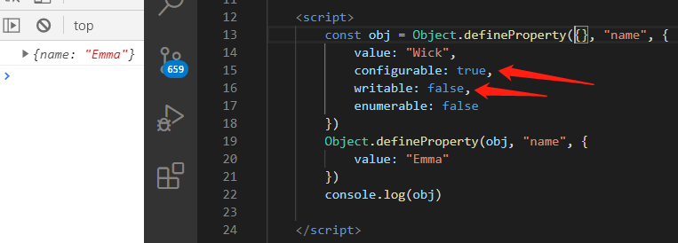
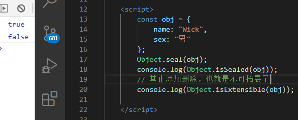

# 属性描述符

## 概述

一个属性，除了属性名和属性值外，还有一些额外的信息，这些信息合在一起，称为属性描述**对象**(attributes Object)


## 需要事先掌握的一些方法

为了后面能方便操作元属性，必须先掌握这些方法。

### Object.getOwnPropertyDescriptor(obj, key)

用于获取属性描述。

```js
const obj = {
    name: "Wick"
}
Object.getOwnPropertyDescriptor(obj, "name")
```


注意：该方法只能获取对象自身的属性==》不能获取继承(原型)来的属性


### Object.defineProperty(obj, key, attributesObj)

用于创建或修改对象的属性，并返回修改后的对象。

```js
const obj = {
    name: "Wick"
}
// 修改
Object.defineProperty(obj, "name", {
    value: "Emma Roberts",
    // ...其他描述符属性
})
// 创建
Object.defineProperty(obj, "sex", {
    value: "女",
    // ...其他描述符属性
})
```


### Object.defineProperties(obj, props)

如果需要一次性创建或修改多个属性，那么就可以使用该方法。

```js
const obj = Object.defineProperties({}, {
    name: { value: "Emma Roberts", enumerable: true },
    sex: { value: "女", enumerable: false },
    isBeauty: { value: true },
    talk: {
        get: function () {
            return `${this.name}==${this.sex}==${this.isBeauty? "很好看": ""}`
        }
    }
})
```


**注意：**如果在定义属性的时候，设置了setter(或者getter)，就不能将`writable`属性设为true，或者设置value属性！

报错：不能同时指定访问器和值或可写属性


Object.defineProperty和Object.defineProperties的属性描述对象中的`configurable`、`writable`、`enumerable`这三个属性的默认值为false。


### Object.getOwnPropertyNames()

用于获取对象自身的全部属性(那肯定是一个数组咯)，不管该属性是否可以枚举。

```js
const obj = {}
Object.defineProperties(obj, {
    name: {value: "Wick", enumerable: true},
    sex: {value: "男", enumerable: false}
})
```


## 元属性

属性描述对象，提供了6个元属性，分别是value、writable、enumerable、configurable、get、set。

### value

表示该属性的属性值，默认为undefined。


### writable

值为Boolean类型，表示属性值(value)是否可以改变，默认为true，表示可更改。


**注意：**只有在严格模式下，重新赋值才会报错


### enumerable

值为Boolean类型，表示该属性是否可遍历，默认为true，如果为false、则该属性不可遍历，会影响```for...in```、```Object.keys```、```Object.values```等操作。


### configurable

值为Boolean类型，表示可配置性，默认为true。表示属性描述对象可以进行修改，如果设为false，则属性描述对象无法进行修改。


configurable能决定目标元素是否可以被删除(delete)。


**注意：**

1. writable只有在false改为true的时候会报错，true改false是允许的

   

2. 只要writable和configurable有一个为true，value就允许改动
   

   


## 存取器

除了直接定义以外，属性还可以用存取器(accessor)定义。使用存取器中的一个(get或set)，那么该属性，**就不是一个普通的属性了**，而是变成存取器属性。


**注意：有了存取器后，不能添加value、writable**


### get()

值为一个函数，表示该属性的取值函数(getter)，默认为undefined，当读取属性时，触发该函数。

参数：无

返回值：即该属性的值


### set(value)

值为一个函数，表示该属性的取值函数(setter)，默认为undefined，当设置属性时，触发该函数。

参数：需要设置的属性值


有意思的是，使用了存取器属性后，这个属性值就不像是我们以前所说的将属性值放到内存空间了，而是变成了去运行存取器函数。


### 存取值问题

这个地方会有点小坑，很有可能会写顺手(小概率事件==》可能是太久没用，忘记了)，然后导致无限递归。

下面这两个写法都会造成无限递归，先想一下是什么原因导致的？

写法一：

```js
const obj = {
    sex: "男"
}
Object.defineProperty(obj, "name", {
    get() {
        console.log("读取name属性，运行了get方法")
    },
    set(value) {
        console.log("设置name属性，运行了set方法", value)
        // 很可能会这样写，想一下为啥会无限递归
        obj.name = value;
    }
})
```
写法二：

```js
const obj = {
    sex: "男"
}
Object.defineProperty(obj, "name", {
    get() {
        console.log("读取name属性，运行了get方法")
        // 很可能会这样写，想一下为啥会无限递归
        return obj.name
    },
    set(value) {
        console.log("设置name属性，运行了set方法", value)
    }
})
```


==========小姐姐分割线


写法一：

set函数本身就是赋值的时候调用的，那在set函数内部，接着写obj.name = value，那肯定无限递归啊。


写法二：

只要读取属性，就会触发get函数，那在get函数中，return obj.name，这个obj.name不还是读属性么，所以也会无限递归。


**那如何才能正确操作呢？**

定义一个其他变量，利用它进行set和get。


哈哈，存取器，就有点类似面向对象编程的三大特征中的封装。


## 对象状态控制

有时需要冻结对象的读写状态，防止对象被改变。JavaScript提供了三种冻结的方法，最弱的一种是`Object.preventExtensions`，其次是`Object.seal`，最强是`Object.freeze`。


### Object.preventExtensions(obj);

该方法可以使得一个对象无法再添加新的属性。


### Object.isExtensible(obj)

该方法检查是否可以为一个对象添加属性(是否设置了`Object.preventExtensions()`)。

为false，说明不可添加==》使用了Object.preventExtensions();


### Object.seal(obj);

该方法能让一个对象无法添加新属性，也无法删除旧属性。


本质：就是把属性描述对象的configurable属性设为false


**注意：Object.seal只是禁止新增或删除属性，并不影响修改某个属性的值**


### Object.isSealed(obj)

该方法用于检查一个对象是否使用了`Object.seal`方法。




### Object.freeze(obj);

该方法能让一个对象**无法添加新属性、无法删除旧属性、也无法改变属性的值**，相当于整个对象变成了常量。


**注意：在严格模式下对属性们做更改会报错**


### Object.isFrozen(obj)

该方法用于检查一个对象是否使用了`Object.freeze`方法。


