# 前置知识

## Function构造函数

Function构造函数，是每一个函数的创造者，并且只能在全局作用域中运行(暗示着无法产生闭包现象)

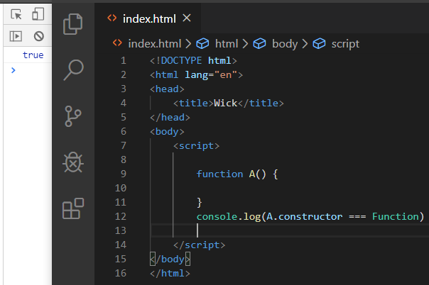

无法产生闭包，通常都是在全局作用域下执行

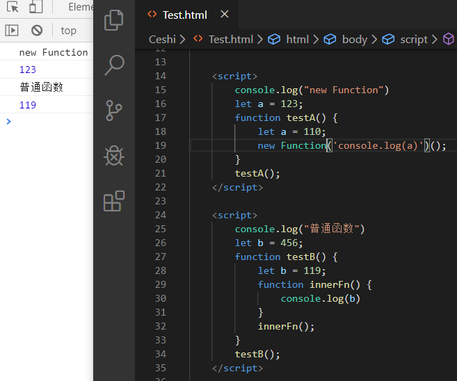


### Function参数解析

摘自MDN官网

~~~js
new Function([arg1[, arg2, arg3....]], fn) 
~~~

### arg1[, arg2, arg3....]

函数的形式参数，必须符合命名规范

### fn

函数体{}中内容，以`;`分隔

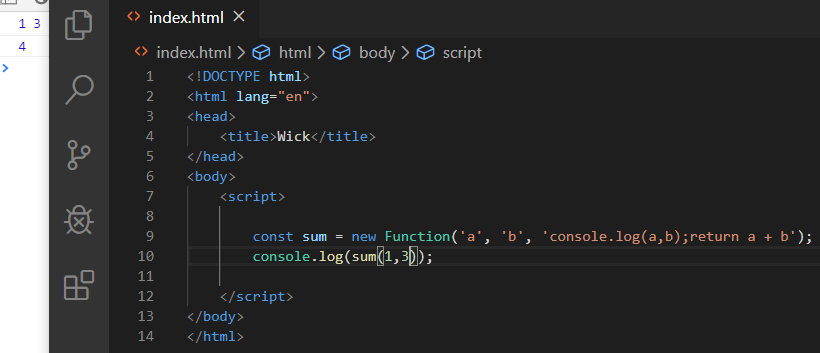


参考地址： https://developer.mozilla.org/zh-CN/docs/Web/JavaScript/Reference/Global_Objects/Function 


### 函数对象

通过Function构造函数构造出来的函数对象，由JS提供，比如Array、Object、String、Number等

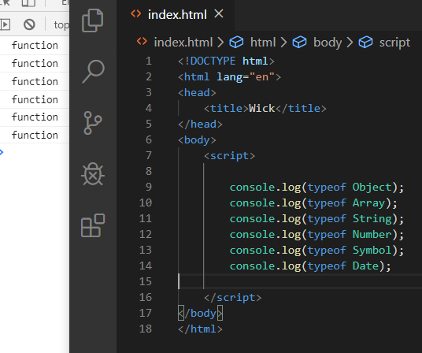


### 自定义函数对象

也是通过Function构造函数构造出来的函数对象，只不过是我们自己定义的

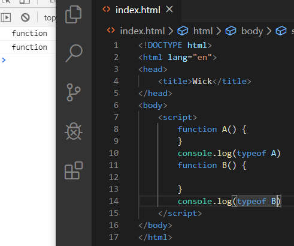


函数对象，都存在原型prototype和隐式原型```__proto__```

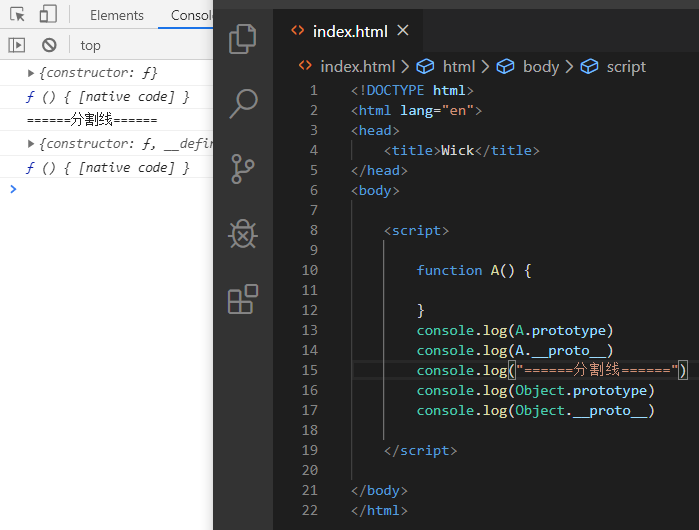


### 普通对象

Function构造函数构造出来的函数(对象)创建出来的对象

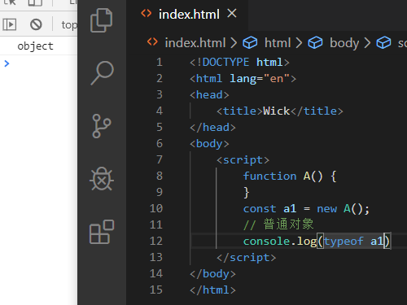


普通对象，只存在隐式原型```__proto__```

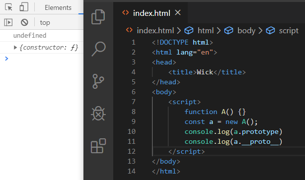


# 原型prototype

原型的出现，就是为了让属性和方法可以共享，以至于减少内存的占用和体现实例对象之间的关系

## new的缺点

使用构造函数创建实例对象，无法共享属性和方法

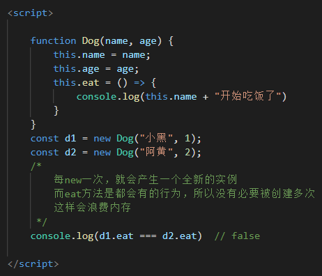


## 使用prototype进行共享

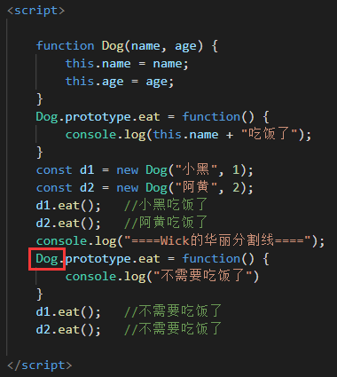


# 隐式原型```__proto__```

大部分对象都存在隐式原型```__proto__```，除了Object.create(null);

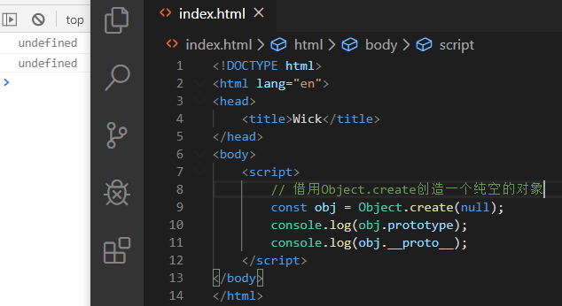

## ```__proto__```的指向

默认指向为创建当前对象的构造函数的原型(prototype)

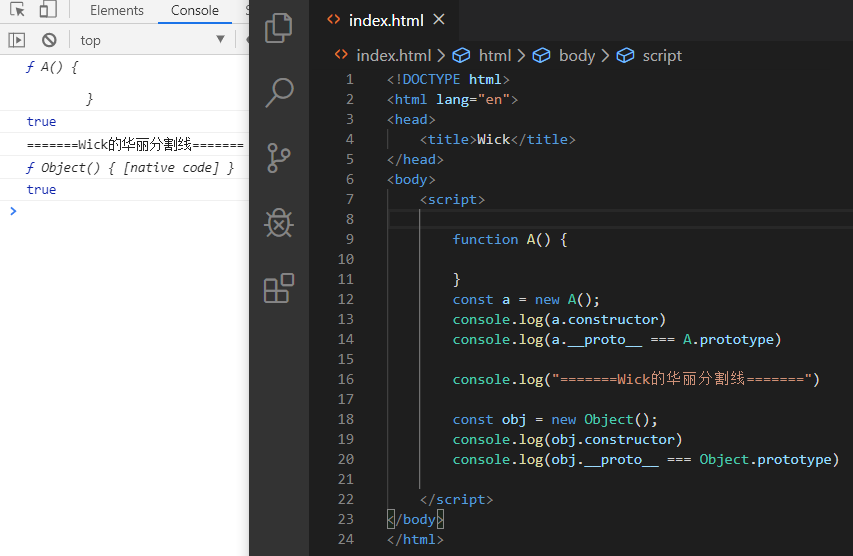


属性和方法的查找过程：

- 先看**当前对象**是否拥有对应的内容，如果有就直接使用
- 如果**当前对象**不存在想要的内容，则沿着原型链依次查找，如果找到**尽头(Object.prototype**)还没有，则返回undefined

# 原型链

概念：大多数对象都有原型，而原型又是一个普通对象，这个普通对象也会有自己的原型，所以就这样形成了一条链，这就是原型链


Function比较特殊，prototype和```__proto__```互相指向，也就是相等

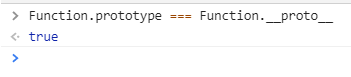


## 普通对象查找过程

正常情况下，是通过隐式原型```__proto__```进行查找

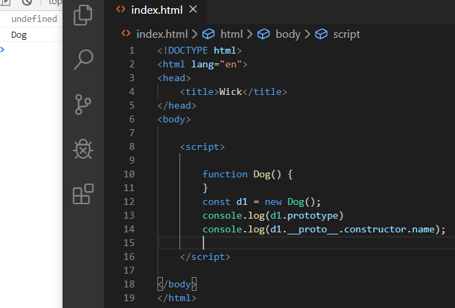


## 函数对象查找过程

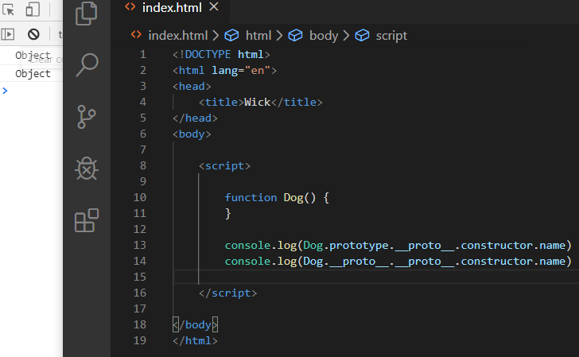


# 函数对象的原型

函数对象都由Function创建，那么它们的隐式原型指向谁？

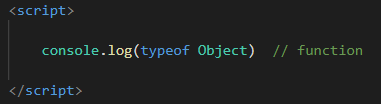


隐式原型的指向是创建该对象的构造函数的原型，Object是谁创造的？Function。Function的原型是谁？Function.prototype(Function.```__proto__```)

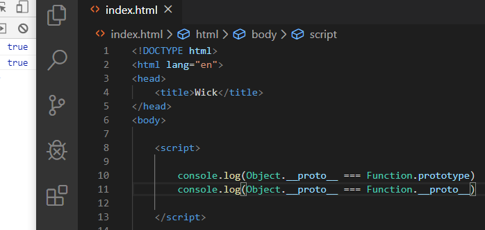

~~~js
console.log(Object.__proto__ === Function.prototype)
console.log(Object.__proto__ === Function.__proto__)
~~~

那Function的原型**也是一个普通对象**，那它的隐式原型又指向谁呢？

又指回了Object.prototype

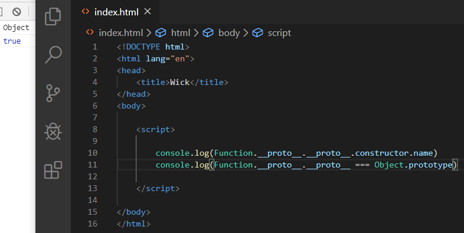


函数对象能创造普通对象，普通对象的隐式原型指向谁？指向创建当前对象的函数对象的原型，那Object的原型是什么？Object.prototype

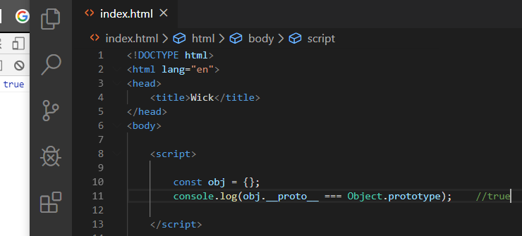

~~~js
const obj = {};
console.log(obj.__proto__ === Object.prototype);    //true
~~~


# 自定义函数对象的原型

自定义函数也是由Function创造的，那么隐式原型指向Function.```__proto__```(Function.prototype)

~~~js
function A() {}
console.log(A.__proto__ === Function.prototype) // true
console.log(A.__proto__ === Function.__proto__) // true
~~~

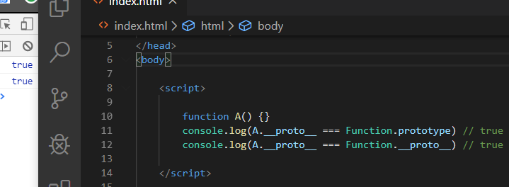


自定义的函数也可以创建自己的对象，那创建出来的对象隐式原型肯定就指向自定义函数对象的原型咯

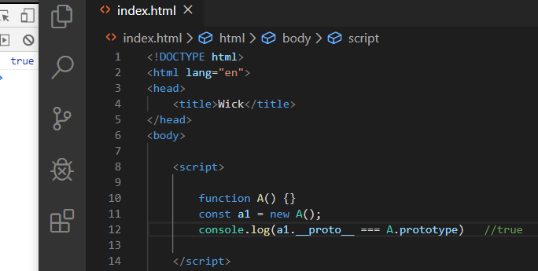

~~~js
function A() {}
const a1 = new A();
console.log(a1.__proto__ === A.prototype)   //true
~~~

那自定义函数对象的原型**也是一个普通对象**，那隐式原型又指向谁呢？

也回到了Object.prototype

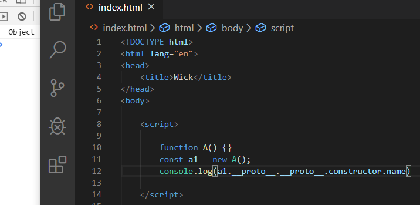


# 流程图

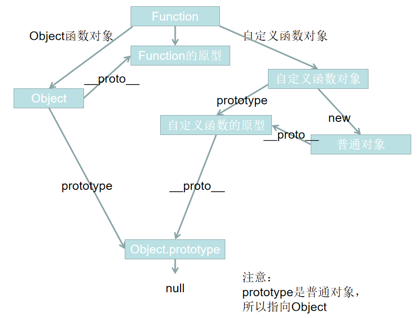


参考文章：

《你不知道的JavaScript上卷》

[JS继承机制的设计思想](http://www.ruanyifeng.com/blog/2011/06/designing_ideas_of_inheritance_mechanism_in_javascript.html)

[Prototype对象](http://javascript.ruanyifeng.com/oop/prototype.html)