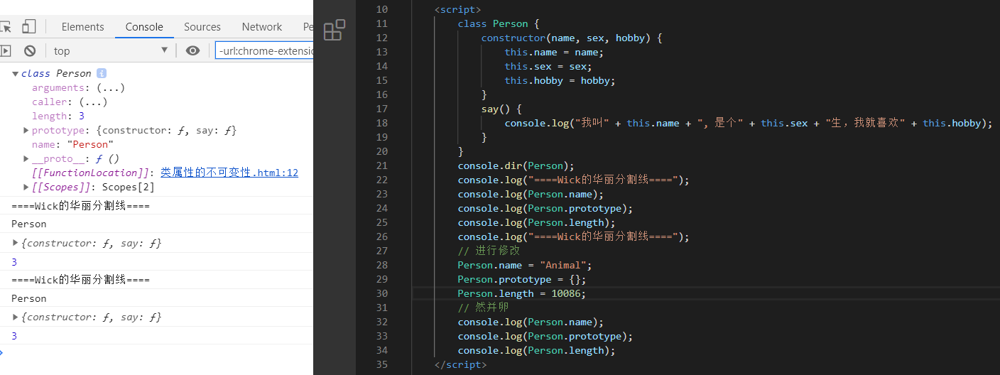
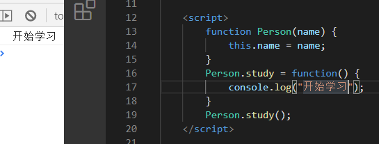
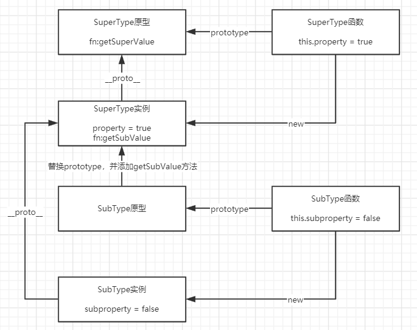

# 前言

> 因为最近是春招，看了大佬们的面经，发现了**类与继承被提及**，而这正好与我最近学习的TS与React有部分关联，所以顺便做一下这部分的总结(文章内容比较简单)。文中参考了很多文章，已在文末标出。**如果在本篇文章中发现错误或者解释有误的地方，请及时指出，将不胜感激。**
>
> 本篇文章(包含测试代码)已收录至github：https://github.com/OnlyWick/FullStack，欢迎star~

# 回顾ES5构造函数创建对象

在进入ES6的class前，先回顾下在ES5中怎么通过构造函数创建对象的吧

## 创建对象

```js
function Person(name, sex, hobby) {
    this.name = name;
    this.sex = sex;
    this.hobby = hobby;
}

Person.prototype.say = function () {
    console.log("我叫" + this.name + ", 是个" + this.sex + "生，我就喜欢" + this.hobby);
}
```


## 特征

1. 函数名采用大驼峰命名法
2. 构造函数内部，会隐式的创建一个对象(this)，并返回
3. 可以有返回值，返回值如果是原始类型，则忽略，引用类型，则直接返回


## 缺点

1. 只是按照命名规范进行命名，本质上还是一个普通函数，所以不采用`new`关键字，也能使用
2. 所有属性(包括方法)都可枚举，在通常情况下，我们是不想要方法被枚举出来的
3. 属性定义与原型方法分离，这不符合面向对象编程语言的模式(比如Java)
4. 不通过原型(prototype)，无法实现属性或方法共享


## new.target

函数内部可以使用`new.target`属性。如果当前函数是`new`命令调用，`new.target`指向当前函数，否则为`undefined`。

```js
function Demo() {
    console.log(new.target)
}
new Demo();
Demo();
```


# ES6之class

## 简介

>尽管JavaScript原型机制并不像传统类那样工作，但这并没有阻止要求这个语言拓展其语法糖使其能够更像真正的类那样表达"类"的强烈趋势，因此有了ES6 class 关键字及其相关的机制。


## 类的声明

```js
class Person {
    // 等价于Person构造函数，注意：构造函数只能有一个!!!
    constructor(name, sex, hobby) {
        this.name = name;
    	this.sex = sex;
        this.hobby = hobby;
    }
    // 等价于Person.prototype.say
    say() {
        console.log("我叫" + this.name + ", 是个" + this.sex + "生，我就喜欢" + this.hobby);
    }
}

// 上下代码可以认为是等效的

function Person(name, sex, hobby) {
    this.name = name;
    this.sex = sex;
    this.hobby = hobby;
}

Person.prototype.say = function () {
    console.log("我叫" + this.name + ", 是个" + this.sex + "生，我就喜欢" + this.hobby);
}
```


**注意：class中的(普通函数)方法会自动被放到原型上，并且是不可枚举的!**


## 类属性的不可变性

与函数不同的是，**类属性(注意是类的属性,不是对象的属性)**不可被赋予新值。

有很多属性，随便修改几个试试吧。




## 常量类名

类的名称，只在类中为常量，所以在类中对齐进行修改会报错，在外部(声明后)是可以对其进行修改的。

**内部的Person,就像是通过const声明的一样,无法进行修改,而外部Person,就像是let声明,可以随便修改**

```js
class Person {
    construtor() {
        Person = "Animal";	// 报错,Assignment to constant variable, 这跟const是一样的错误
    }
}
```


```js
class Person {
}
Person = "Animal";
```


**注意：需要跟前面的类属性的不可变性区别开来，这里相当于只是变量的重新赋值。**


## 访问器(getter与setter)

这个语法很简单，跟Object.defineProperty的存取器很像，就直接看吧

```js
class Person {
    constructor(name, sex, hobby) {
        this.name = name;
        this.sex = sex;
        this.hobby = hobby;
    }
    // 取值函数，不接收参数
    get name() {
        console.log("取值函数运行啦");
        // 注意递归问题
        return this._name;
    }
    // 存值函数，允许接收一个参数
    set name(value) {
        console.log("存值函数运行啦");
        // 注意递归问题
        this._name = value;
    }
    say() {
        console.log("我叫" + this.name + ", 是个" + this.sex + "生，我就喜欢" + this.hobby);
    }
}
```


这个访问器比较简单，需要注意的地方就是**防止递归**了~


## 静态成员

静态成员**属于类本身**，并且类的**实例对象无法访问**。

```js
class Person {
    constructor(name, sex, hobby) {
        this.name = name;
        this.sex = sex;
        this.hobby = hobby;
    }
    static isTall = true;
	static eat() {
    	console.log("人类会吃饭");
	}
	say() {
    	console.log("我叫" + this.name + ", 是个" + this.sex + "生，我就喜欢" + this.hobby);
	}
}
```


静态成员位于类的实例对象的隐式原型(`__proto__`)的`constructor`上，即类对象本身。


可能有小伙伴理解不了静态成员或者说是实例对象，所以我这里把相关的名词也说一下。

属性：除了表示正常的属性(状态)外，也有人把方法(动作)也称为属性，但是实质上都是一样的，因为方法也是一种属性

成员：对象的属性或方法

静态成员：属于类的成员

实例成员：属于对象的成员

实例对象：由(构造)函数创建出来的对象，函数对象(这里指由JS提供的内置函数对象，比如Array)和自定义函数对象(自己定义的函数。当然这也是包括`class`的，它只是一个语法糖而已)


### ES6之前的静态成员

在ES6之前，直接将类成员添加到构造函数中来模拟静态成员

```js
function Person(name) {
    this.name = name;
}
Person.study = function() {
	console.log("开始学习");
}
```




## 私有方法和私有属性

私有方法和属性，是只能在类的内部访问的，外部不能访问，这是常见的需求，有利于代码封装，但ES6不提供相关操作。

### 方法一：命名区别

在名称前加上`_`或者`__`等字符，代表这是私有属性，当然这只是一个约定，比如Vue中就有类似的`$`代表私有属性或方法。

```js
class Person {
    length = 10;
    constructor(name, weight) {
        this.name = name;
        this.weight = weight;
    }
    loseWeight() {
        this._exercise();
        console.log(`啊,我从${this.weight + this.length}斤瘦到${this.weight}斤了`);
    }
	// 私有属性
    _exercise() {
        for(let i = 1; i <= this.length; i ++) {
            this.weight --;
        }
    }
}
```


### 方法二：抽出需要私有的方法

因为类中的方法，都是对外部可见的。所以可以把需要私有的方法抽到外面去，至于this，直接使用call等方法进行转绑。

```js
function exercise() {
    for(let i = 0; i < this.length; i ++) {
        this.weight --;
    }
}
class Person {
    constructor(name, weight) {
        this.name = name;
        this.weight = weight;
    }
    loseWeight() {
        exercise.call(this);
    }
}
```


### 方法三：Symbol

利用Symbol的唯一性


### 提一个小点，可跳过

顺便提一下，上面这些方法可能有人会想**(没错,就是我)**，你这样做，我都看得见，我还可以修改代码，或者说还可以直接调用，那这样属性还有方法还不是没有起到私有的作用。而且`Reflect.ownKeys()`还可以拿到Symbol呢，你这样也能算私有？


哈哈，这是我好久前学ES6的想法。上面这些让 属性和方法私有 的方法，只是我们一些实现的手段而已，如果想要钻空子还不简单？私有的目的，只是让我们在造轮子或者对某一个东西进行封装的时候，**不想让别人直接使用的东西而已**。


### 方法四：使用正在提案中的语法

采用`#`字符，对成员进行私有。

**注意：由于该语法正在提案，所以兼容性有问题，需要使用`babel`进行转化**

**什么是babel?**

**Babel 是一个工具链，主要用于将 ECMAScript 2015+ 版本的代码转换为向后兼容的 JavaScript 语法，以便能够运行在当前和旧版本的浏览器或其他环境中。**


简单介绍下配置项，**详细请移步babel官网(文末附地址)**

`@babel/preset-env`：一个智能预设，能让你使用ES2015+(最新)的语法

`useBuiltIns`：配置`preset-env`如何处理polyfill

`corejs`：含有最新版ES的语法和API实现

`@babel/plugin-proposal-class-properties`：用于兼容正在提案中的属性

`@babel/plugin-proposal-private-method`：一个**在提案中的私有方法**的插件，用于兼容#method

```json
// .babelrc配置
{
    "presets": [
        ["@babel/preset-env", {
            "useBuiltIns": "entry",
            // 在preset-env中，默认引入的是corejs的2版本，但是我们下载的是3的版本，所以路径会不一致，这里配置一下即可
            "corejs": 3	
        }]
    ],
    "plugins": [
        "@babel/plugin-proposal-class-properties",
        "@babel/plugin-proposal-private-methods"]
}
```


```js
class Person {
    // 私有属性
    #length = 10;
    constructor(name, weight) {
        this.name = name;
        this.weight = weight;
    }
    loseWeight() {
        // 类内部可以使用
        this.#exercise();
        console.log(`啊,我从${this.weight + this.#length}斤瘦到${this.weight}斤了`);
    }
	// 私有方法
    #exercise() {
        console.log("开始锻炼")
        for (let i = 0; i < this.#length; i++) {
            this.weight--;
        }
    }
}
const p1 = new Person("Wick", 135);
p1.loseWeight();
```


无法访问私有属性，报错


无法访问私有方法，报错


特点：

1. `#`是成员名的一部分，需要一起使用

2. 私有成员可以使用getter与setter，注意getter与setter不能与私有成员重名

   使用getter与setter后，私有成员就可以通过它们来进行取值和赋值(感觉没啥意义)

   ```js
class Counter {
       #xValue = 0;

       add() {
        console.log(++ this.#x);
       }
       print() {
           console.log(`最终结果为: ${this.#x}`);
       }
       get #x() { return this.#xValue; }
       set #x(value) {
           this.#xValue = value;
       }
   }
   
   const c1 = new Counter();
   c1.add();
   c1.add();
   c1.add();
   c1.print();
   ```
   
   
   
   
   
   
   
   不允许重名
   
   ```js
   class Counter {
       // 重名
       #xValue = 0;
   
       add() {
           console.log(++ this.#x);
       }
       print() {
           console.log(`最终结果为: ${this.#x}`);
       }
   	// 重名
       get #xValue() { return this.#xValue; }
       // 重名
       set #xValue(value) {
           this.#xValue = value;
       }
   }
   
   const c1 = new Counter();
   c1.add();
   c1.add();
   c1.add();
   c1.print();
   ```
   
   
   
   
   
3. 不限于`this`使用，只要在类的内部，**本类实例**也是可以使用的

   ```js
   class Counter {
       #myName = "Counter";
   
       static getMyName(c) {
           return c.#myName;
       }
   }
   
   console.log(Counter.getMyName(new Counter()))
   ```

   

   

   不是类的实例对象，则无法获取

   ```js
   class Counter {
       #myName = "Counter";
   
       static getMyName(c) {
           return c.#myName;
       }
   }
   // []不是类的实例
   console.log(Counter.getMyName([]))
   ```

   

   

4. 允许添加`static`关键字，变成静态私有成员
   私有，只能在类中使用，static，由类名调用，综合一下，就成了只能在类中使用的静态私有成员，外部调用就会报错

   ```js
   class Counter {
       static #Demo() {
           return "Counter";
       }
       static getMyName() {
           return Counter.#Demo();
       }
   }
   console.log(Counter.getMyName());
   ```

   

   

   外部调用报错

   ```js
   class Counter {
       static #Demo() {
           return "Counter";
       }
       static getMyName() {
           return Counter.#Demo();
       }
   }
   Counter.#Demo();
   ```

   

   


**上面代码只是为了方便举例，所以会有很多不足，懂意思就好啦。**


## 属性初始化器(Property initializer)

属性初始化器，是ES7的内容，如果担心兼容性的问题，请使用`babel`进行转换

```js
class Person {
    static age = 18;
	isTall = true;
}

// 上下代码等效
class Person {
    constructor() {
        // 相当于写在构造函数中
        this.isTall = true;
    }
}
```


### 注意一下：箭头函数和普通函数的小区别

在写代码的时候，可能一个不经意间，就会导致this指向出现问题(由于有严格模式，所以会直接报错了)。

来康康，正常函数的写法，会有什么问题。

```js
class Pig {

    constructor(name) {
        this.name = name;
    }

    eat() {
        console.log(this);
        console.log(`${this.name}开始恰饭`);
    }
}
const pig = new Pig("肥猪一号");
const temp = pig.eat;
temp();
```

在方法里面使用this，那肯定是会有的，但是这样会带来一个问题，如果不小心导致this指向发生改变，比如上面这个情景，就会报错。


为了防止上面的错误发生，很多人就会利用箭头函数的特性，来让this指向当前实例对象。

```js
class Pig {
    constructor(name) {
        this.name = name;
    }
    
    eat = () => {
        console.log(`${this.name}开始恰饭`);
    }
}
const pig = new Pig("肥猪二号");
const temp = pig.eat;
temp();
```


细心的小伙伴就会发现，这个**eat方法已经不在原型上了，跑到了实例对象上。**那这个就跟我们前面所说的，函数方法会被放到原型上，并且是不可枚举的，产生了**冲突**。


那不用想，这肯定是**占用内存空间**咯。所以我们需要根据场景进行衡量使用哪种函数，比如某个对象不会创建很多次，那没事，我们就让它占用咯，但是有些对象需要创建非常多次，那肯定就不能使用了。


## 类表达式


### 匿名表达式

```js
const Person = class {
    constructor(name) {
        this.name = name;
    }
}
console.log(new Person("Wick").name);
```


### 命名表达式

```js
const Person = class Person2 {
    constructor(name) {
        this.name = name;
    }
}
console.log(Person);
console.log(Person2);
```


类表达式的另一种使用方法，这个方法可以创建单例，并且不会在作用域中暴露类的引用。

```js
const bugEngineer = new class {
    constructor(name) {
        this.name = name;
    }
    writeBug() {
        console.log(`${this.name}开始写Bug了`);
    }
}("Wick");
```


## 一等公民的类

在程序中，一等公民指的是一个**可以传入函数**，可以从**函数返回**，并且可以**赋值给变量的值**。JavaScript函数是一等公民(也被称为头等函数)，这也正是JavaScript的一个独特之处。

ES6延续了这个传统，将**类也设计为一等公民**，**允许通过多种方式使用类的特性**。

将类作为参数传入函数中

```js
function createObject(classDef) {
    return new classDef();
}
const obj = createObject(class {
    sayHi() {
        console.log("Hi~")
    }
})
obj.sayHi();
```


## 装饰器函数(Decorator)

> 哈哈，第一反应这玩意不就是注解吗。

该函数是ES7引入的，它用来修改类的行为，并且该函数处于提案的二阶段，**在将来版本可能发生重大改变**。

装饰器有类装饰器，属性装饰器，方法装饰器，由于诸多原因，这里就拿方法装饰器来随便玩一下。

**注意：兼容性十分不好，浏览器和NodeJs都不支持。所以想要使用的话，就借助Babel或者TypeScript吧~**

我这里就接着用babel吧，(别问为什么不用TS，我TS还没学到这，说到这里，我又**流下了没有技术的眼泪**)。

安装插件：

`@babel/plugin-proposal-class-properties`：用于兼容正在提案中的属性

`@babel/plugin-proposal-decorators`：用于支持Decorators

详细信息，请移步官网(文末有地址)

```json
{
    "presets": [
        [
            "@babel/preset-env",
            {
                "useBuiltIns": "entry",
                "corejs": 3
            }
        ]
    ],
    "plugins": [
        [
            "@babel/plugin-proposal-decorators",
            {
                "legacy": true
            }
        ],
        [
            "@babel/plugin-proposal-class-properties",
            {
                "loose": true
            }
        ]
    ]
}
```

直接上代码，相关信息写在注释里了

```js
/**
 * 
 * @param {*} target ：所作用的对象
 * @param {*} prop ：作用的成员名
 * @param {*} descriptor ：属性描述符(Object.defineProperty)
 */
function writeBug(target, prop, descriptor) {
    console.log(target)
    console.log(prop)
    console.log(descriptor)
}
class Person {
    
    constructor(name) {
        this.name = name;
    }
    @writeBug
    writeCode() {
        console.log(`${this.name}能写出很好的代码`);
    }
}
```

哈哈，你看，你都拿到属性描述符了，想做一些别的操作还不容易嘛

```js
/**
 * 
 * @param {*} target ：所作用的对象
 * @param {*} prop ：作用的成员名
 * @param {*} descriptor ：属性描述符
 */
function writeBug(target, prop, descriptor) {
    console.log(target);
    console.log(prop);
    console.log(descriptor);
    // 存储原来的函数
    let value = descriptor.value;
    // 重写value，函数允许接收参数
    descriptor.value = function(args) {
        console.error(`↓↓↓别听${this.name}的吹牛，他就是一Bug工程师`);
        value.call(this);
    }
}
class Person {
    
    constructor(name) {
        this.name = name;
    }
    @writeBug
    writeCode() {
        console.log(`${this.name}能写出很好的代码`);
    }
}
const wick = new Person("Wick");
wick.writeCode();
```


哈哈，上面开个玩笑，装饰器其实还是很强大的，比如你造了一个轮子，里面很有很多方法，然后有非常多的人去用它，然后有一天，你发现，哎，这个方法时间复杂度和空间复杂度都不是很好，有更好的实现方法。但是使用的人非常多，你并不能直接把该方法删除掉，因为这样会导致很多人的项目突然崩溃，他们还可能还找不到问题在哪。所以其中一个方法，就是在下一个版本进行更新，另一种方法就是，借用装饰器，来标注该方法已经过时，请替换成xxxx方法(当然还有别的方法，这里只是举例)。

拿最近学习的React来说，它的旧版生命周期的部分钩子函数，会造成Bug，但是在新版的生命周期中，它们还存在着，只不过你在使用的时候，给你报黄了而已，就这样的操作是可以拿装饰器来实现(并未看过源码，这里只是举例)。


嗯，关于taget还是说一下吧，有几种情况

情况一：作用于类的时候

target为该类函数


情况二：作用于类中的成员

看到constructor，想到了啥？没错，target为该类原型


## 继承

### ES6之前继承实现

先看看在ES6之前，经典继承是怎么实现的吧。

**注：下面两个代码片段以及优缺点摘自冴羽大大的文章，[点击直达文章地址](https://github.com/mqyqingfeng/Blog/issues/16)**

```js
function Parent () {
    this.names = ['kevin', 'daisy'];
}

function Child () {
    Parent.call(this);
}

var child1 = new Child();

child1.names.push('yayu');

console.log(child1.names); // ["kevin", "daisy", "yayu"]

var child2 = new Child();

console.log(child2.names); // ["kevin", "daisy"]
```

优点：

1.避免了引用类型的属性被所有实例共享(把所有属性都初始化到子类实例上)

2.可以在 Child 中向 Parent 传参

```js
function Parent (name) {
    this.name = name;
}

function Child (name) {
    Parent.call(this, name);
}

var child1 = new Child('kevin');

console.log(child1.name); // kevin

var child2 = new Child('daisy');

console.log(child2.name); // daisy
```

缺点：

方法都在构造函数中定义，每次创建实例都会创建一遍方法。

---


我也有点想法，所以在此基础上，做了些更改。

```js
// 父类
function BugEngineer(name) {
    // 面向抽象编程
    if (new.target === BugEngineer) {
        throw new Error("该类为抽象类，您不能直接调用");
    }
    this.name = name;
}

BugEngineer.prototype.writeBug = function () {
    console.log(`${this.name}开始写Bug啦`);
}
// 子类
function Engineer(name) {
    BugEngineer.call(this, name);
}

// 更改子类原型
Engineer.prototype = Object.create(BugEngineer.prototype);
// 更改子类构造函数
Engineer.prototype.constructor = BugEngineer;
```


更改对象原型(不考虑直接赋值的情况)，有两个方法`Object.setPrototypeOf()`与`Object.create`

Object.setPrototypeOf是能改变对象原型的，但是我看了一下MDN文档，它给出了以下解释。


所以，因为在性能方面存在问题，所以建议我们采用Object.create来改变原型，更多细节请移步MDN。


### 正文开始

### extends与super

前面也看过了在ES6之前实现继承的方式之一，会发现，要实现继承还是有点麻烦的。但是在ES6出现了`extends`与`super`关键字，帮我们省去了这些不必要的"麻烦事"。

```js
// 父类
class BugEngineer {
    constructor(name) {
        if(new.target === BugEngineer) {
           throw new Error("该类为抽象类，您不能直接调用");
        }
        this.name = name;
    }
    writeBug() {
        console.log(`${this.name}开始写Bug啦`);
    }
}

// 子类
class Engineer extends BugEngineer {
    constructor(name) {
        // 等价于BugEngineer.call(...)
        super(name);	// super代表父类的构造函数
    }
}
```

原型会自动帮我们调整，super会去访问父类的构造函数~


super使用注意事项：

1. 指定了构造函数，必须使用super关键字。

   你都有了构造函数，还不用super，谁去帮你创建父类让你继承(肯定是先有父类，才能有子类，对吧)？

   ```js
   class Engineer extends BugEngineer {
   }
   // 等价于
   class Engineer extends BugEngineer {
       constructor(name) {
           super(name);
       }
   }
   ```

   **注意：class并不会限制你在super语句前进行别的操作(this除外)，但是我还是建议把所有语句放到super后，以避免不必要的麻烦**

   

   

2. 只能**在派生类**的**构造函数中**使用`super()`，如果尝试在非派生类(不是用extends声明的类)或函数中使用，则会报错。
  
  
   **注意：派生类和子类是一个意思**
   
   
   
   
   
3. 在构造函数中访问**this之前一定要调用super**，它负责初始化this，如果在调用super之前尝试访问this，则会报错。
   

   
   
   从下面代码中，可以看到`super()`执行时，它指向的是子类的构造函数，所以可以知道`super()`中的`this`指向的子类实例
   
   ```js
   class A {
       constructor() {
           console.log(new.target.name, this);
       }
   }
   class B extends A {
       constructor() {
           super();
       }
   }
   new A();
   new B();
   ```
   
   
   
   
   
4. `super`**作为对象时**，在**普通方法**中，指向父类的**原型对象**，在**静态方法**中，指向**父类**。
   **注意是作为对象，而不是方法调用!!!!**

   ```js
   // 父类
   class BugEngineer {
       demo() {
           console.log("BugEngineer的demo");
       }
   }
   
   // 子类
   class Engineer extends BugEngineer {
       constructor(name) {
           super(name);
           // 这里是作为一个对象
           super.demo();
       }
       demo() {
           console.log("Engineer的demo");
       }
   }
   const wick = new Engineer("Wick");
   ```

   根据前面所学的知识，发现`super.demo()`能调用到父类的方法，就能知道它`super`指向了父类的原型`BugEngineer.prototype`，所以`super.demo()`相当于了`BugEngineer.prototype.demo()`。

   

   

   既然知道它指向了父类的原型，那么父类实例对象上的东西，是肯定调不到的

   ```js
// 父类
   class BugEngineer {
    constructor() {
           this.didadida = 123;
           this.dududu = function () {
               console.log(13)
           }
           console.log(this)
       }
   }
   
   // 子类
   class Engineer extends BugEngineer {
       constructor(name) {
           super(name);
           // 这里是作为一个对象
           console.log(super.didadida);
           console.log(super.dududu)
       }
   }
   ```
   
   
   
   
   

   

如果把**属性定义在原型**上，super就可以取到

```js
   // 父类
   class BugEngineer {
   }
   BugEngineer.prototype.dududu = 123;
   
   // 子类
   class Engineer extends BugEngineer {
       demo() {
           console.log(super.dududu);
       }
   }
```

   

   

   super**对象**在**静态方法**中，指向的是**父类**，所以能调用的就是父类的静态成员(当然有父类了，就也可以去操作原型，但是原型中的成员用到this，你打算咋办？)。

   ```js
   // 父类
   class BugEngineer {
       // 该方法在类上
       static biubiubiu() {
           console.log("biubiubiu");
       }
       // 该方法在类的原型上
       boomboomboom() {
           console.log("boomboomboom");
       }
   }
   
   // 子类
   class Engineer extends BugEngineer {
       static demo() {
           super.biubiubiu();
           super.boomboomboom();
       }
   }
   console.dir(BugEngineer)
   Engineer.demo();
   ```

   

   

5. ES6规定，在**子类普通方法**中通过**`super对象`调用父类的方法**时，方法内部的**`this`指向当前的子类实例**。

   

   ```js
   // 父类
   class BugEngineer {
       constructor() {
           this.A = 2;
       }
       print() {
           console.log(this.A)
       }
   }
   // 子类
   class Engineer extends BugEngineer {
       constructor() {
           super();
           this.A = 1;
           super.print();
       }
   }
   new Engineer();
   ```

   `super.print()`虽然调用的是`BugEngineer.prototype.print()`，但是`BugEngineer.prototype.print()`**内部的this指向子类**`Engineer`的**实例**，所以打印出了1，这实际上相当于执行了`super.print.call(this)`

   **再次强调：super在普通函数中当对象使用，就是指向父类的原型对象!!!**

   

   

   在上面的基础上，就可以知道，如果在普通方法中使用`super对象`**调用父类方法**，会导致**this指向子类实例**，那么如果使用`super对象`**对某一个东西的赋值**，**那最终也会赋到子类实例上**
   
   **注意：上面的粗体字，强调的是使用super对象对某一个东西的赋值，对某一个东西的赋值，对某一个东西的赋值，并不代表的是取值或调用方法!!!**
   
   ```js
   // 父类
   class BugEngineer {
       constructor() {
           this.x = 456;
       }
   }
   // 子类
   class Engineer extends BugEngineer {
       constructor() {
           super();
           this.x = 10086; // 对Engineer实例赋值
           console.log(this.x);
           // 使用super对象进行赋值,最终会赋到Engineer实例上
           super.x = 123;
        console.log(this.x);    // 读取Engineer实例的值
           // 读取父类BugEngineer原型对象上的属性，因为不存在，所以为undefined
        console.log(super.x)    
       }
}
   ```

   

   

   给父类原型添加属性

   ```js
// 父类
   class BugEngineer {
    constructor() {
           this.x = 456;
    }
   }
// 添加属性
   BugEngineer.prototype.x = "除了写Bug，什么都不会"
// 子类
   class Engineer extends BugEngineer {
       constructor() {
           super();
           this.x = 10086; // 对Engineer实例赋值
           console.log(this.x);
           // 使用super对象进行赋值,最终会赋到Engineer实例上
           super.x = 123;
           console.log(this.x);    // 读取Engineer实例的值
           // 读取父类BugEngineer原型对象上的属性，因为不存在，所以为undefined
           console.log(super.x)    
       }
   }
   ```
   
   
   
   
   
6. 在**子类**的**静态方法**中通过`super`**调用父类的方法**时，方法内部的`this`**指向当前的子类**，而**不是子类的实例**。
  
   ```js
    // 父类
    class BugEngineer {
      constructor() {
          this.A = 2;
      }
      static biubiubiu() {
          console.dir(this)
          console.log(this.x)
      }
    }
    // 子类
    class Engineer extends BugEngineer {
      constructor() {
          super();
          this.x = 10086;
      }
      static son() {
          super.biubiubiu();
      }
    }
   ```

  

   

7. 使用`super`的时候，必须显式指定是作为函数、还是作为对象使用，否则会报错。
  
  ```js
  // 父类
  class BugEngineer {
      constructor() {
      }
  }
  // 子类
  class Engineer extends BugEngineer {
      constructor() {
          super();
          console.log(super);
      }
  }
  ```
  
  
  
  
  
  上面代码中，`console.log(super)`当中的`super`，无法看出是作为函数使用，还是作为对象使用，所以 JavaScript 引擎解析代码的时候就会报错。这时，如果能清晰地表明`super`的数据类型，就不会报错。
  
  ```js
  // 父类
  class BugEngineer {
  }
  // 子类
  class Engineer extends BugEngineer {
      constructor() {
          super();
          console.log(super.valueOf() instanceof Engineer)
      }
  }
  ```
  
  
  
  上面代码`super`调用了父类的方法`valueOf`，导致this指向当前实例。
  
  
  
  
  
  由于对象总是继承别的对象，所以可以在任意一个对象中，使用`super`关键字
  
  ```js
  const obj = {
      toString() {
          return `MyObject: + ${super.toString()}`
      }
  }
  ```
  
  
  
  
  
  
  
  最后总结一下super的注意事项
  
  1. 指定了构造函数，必须使用super关键字。
  2. 只能**在派生类**的**构造函数中**使用`super()`，如果尝试在非派生类(不是用extends声明的类)或函数中使用，则会报错。
  3. 在构造函数中访问**this之前一定要调用super**，它负责初始化this，如果在调用super之前尝试访问this，则会报错。
  4. `super`**作为对象时**，在**普通方法**中，指向父类的**原型对象**，在**静态方法**中，指向**父类**。
  5. ES6规定，在**子类普通方法**中通过`super对象`**调用父类的方法**时，方法内部的**`this`指向当前的子类实例**。
  6. 在**子类**的**静态方法**中通过`super`**调用父类的方法**时，方法内部的`this`**指向当前的子类**，而**不是子类的实例**。
  7. 使用`super`的时候，必须显式指定是作为函数、还是作为对象使用，否则会报错。
  
  

### 静态成员也可以被继承

```js
class BugEngineer {
    static writeBug() {
        console.log("编程10小时，改Bug 9小时，oh~yeah!")
    }
}
class Engineer extends BugEngineer {
}
Engineer.writeBug();
```


### 类方法的遮蔽

在派生类(子类)中的方法总会**覆盖父类中同名的方法**。

```js
// 父类
class BugEngineer {
    writeBug() {
        console.log("只会写Bug")
    }
}
// 子类
class Engineer extends BugEngineer {
    // 重写(遮蔽)父类方法
    writeBug() {
        console.log("努力学习，少写Bug")
    }
}
```


根据原型链的查找规则，画了一张图

Engineer实例对象不断沿着隐式原型`__proto__`向上寻找writeBug方法，就是因为子类和父类的原型上方法会同名，才导致了遮蔽。

白话：如果有同名，先找到谁的就用谁的。


当然不止有类方法会遮蔽，属性也是一样的

```js
// 父类
class BugEngineer {

}
BugEngineer.prototype.x = "BugEngineer";
// 子类
class Engineer extends BugEngineer {
}
Engineer.prototype.x = "Engineer";

console.log(new Engineer().x);
```


静态方法也是一样的。


### 为什么super代表父类的构造函数返回的却是子类的实例

因为`super`相当于是`BugEngineer.prototype.constructor.call(this)`

```js
class BugEngineer {
}
class Engineer extends BugEngineer {
}
```


# ES5构造函数与ES6的Class对比

## this的转绑

ES5中，可以通过call，apply等直接改变this

```js
function Master() {
}
function Test() {
    console.log(this)
}
const master = new Master();
Test.call(master);
```


在ES6中的class，并不允许这样操作，因为需要使用`new`关键字

```js
class Test {}
Test.call({});  // TypeError: Class constructor Test cannot be invoked without 'new'
// new Test.call({});
```


## 变量声明提升与临时死区(TDZ)

ES5构造函数：

1. 存在变量声明提升
2. 没有TDZ
3. 会导致全局变量污染
4. 允许重复声明

```js
console.log(Test);
function Test(name) {
    this.name = name;
}
console.log(window.Test);
function Test(name) {
    this.doubi = name;
}
console.log(new Test("oooo"))
```


ES6中的class

1. 不存在变量声明提升
2. 含有TDZ
3. 不会污染全局变量
4. 不允许重复声明

```js
console.log(Test);  // ReferenceError: Cannot access 'Test' before initialization
class Test {
    constructor(name) {
        this.name = name;
    }
}
console.log(window.Test);	// undefined
class Test {    // SyntaxError: Identifier 'Test' has already been declared

}
```


## 严格模式

ES5并没有这些限制，只有ES6有

举个简单的例子，变量未声明就使用，或者删除某个变量，严格模式限制很多，这里不一一展示，请自行测试~

变量未声明就使用

```js
class Test {
    constructor() {
        x = 123;
    }
}
new Test();
```


删除某个变量

```js
class Test {
    constructor() {
        let ddd = 123;
        delete ddd;
    }
}
```


## 方法不可枚举

ES5中，对象的方法和属性，都是可以被枚举的

```js
function Demo() {
    this.xx = 123;
    this.say = function() {
        console.log("say")
    }
}
Demo.prototype.ss = function() {
    console.log("ss")
}
const obj = new Demo();
for (const key in obj) {
    console.log(key)
}
```


在ES6中，方法是不允许被遍历的，除非你手动添加在原型上的

```js
class Demo {
    xx = 123;
say() {
    console.log("say")
}
}
Demo.prototype.ss = () => {
    console.log("ss")
}
const obj = new Demo();
for (const key in obj) {
    console.log(key)
}
```


## 不能对对象的方法使用new关键字

在ES5中，这些方法其实就是普通函数，new肯定是可以的

```js
function Test(name) {
    this.name = name;
    this.say = function(d) {
        this.d = d;
    }
}
const obj1 = new Test("Wick");
console.log(obj1);
// 保存say方法
const Say = obj1.say;
const obj2 = new Say("10086");
console.log(obj2)
```


在ES中的class，就不能这样操作了，它们全部都没有`constructor`，手动添加到原型上的方法不算


## 必须使用new关键字调用

ES5构造函数，就一普通函数


ES中的class，必须使用`new`关键字

```js
class Demo {

}
Demo();
```


## 类中无法修改类名

ES5构造函数

```js
function Demo() {
    Demo = 123;
}
const obj = new Demo();
console.log(Demo)
```


ES6中的class，是无法在内部修改类名的

```js
class Demo {
    constructor() {
        Demo = 123;
    }
}
const objb = new Demo();
```


# 简单模拟ES6的class

对比完ES5构造函数与ES6的class，那我们一起来用ES5模拟一下ES6的class吧。

先思考，需要哪些必须条件？

1. 严格模式
2. 方法不可枚举
3. 类必须使用`new`关键字，类的实例对象的方法不能使用`new`关键字
4. 使用后需要返回一个对象
5. 类中无法修改类名


嗯，差不多就这些条件。

`严格模式`：没什么好说的，直接一个"use strict"。

`方法不可枚举`：你想到了什么？嗯，Object.defineProperty

`new关键字`：最简单的方法，使用new.target，不用`instanceof`

`返回对象`：返回，那肯定是函数了对吧，再明确一点就是差一个构造函数(构造嘛，那肯定要返回一个值咯)

`类中无法修改类名`：使用const特性，不允许重复声明与修改

```js
let BugEngineer = (function () {
    "use strict";
    // 使用const，防止修改和重复声明
    const BugEngineer = function (name) {
        // 必须new
        if (typeof new.target === "undefined") {
            throw new Error("请使用new关键字");
        }
        this.name = name;
    }
    Object.defineProperties(BugEngineer.prototype, {
        writeBug: {
            value: function () {
                // 不能new
                if (typeof new.target !== "undefined") {
                    throw new Error("不能使用new关键字调用该方法");
                }
                console.log(`${this.name}开始写Bug`)
            },
            // 不可枚举
            enumerable: false,
            writable: true,
            configurable: true,
        }
    })
    // 返回函数
    return BugEngineer;
})();
```


# 面向对象三大特征及代码实现

由于ES6的class会自动帮我做好优化，所以以下代码大部分为ES5的实现方式

## 封装

封装说的就是对一些属性和方法的**隐藏与暴露**，比如私有属性、私有方法、公有属性、公有方法等等。

关于封装的思想，JavaScript并没有显性的存在，但是我们可以通过灵活的技巧来实现它。


### 创建私有变量和私有方法

利用JavaScript的函数级作用域(声明在函数内部的变量和方法在外界无法访问到)创建私有变量和私有方法。

先**了解几个名词**，后面代码会标有相关注释

对象的**公有属性与公有方法**：在函数内部通过this创建的实例对象会拥有的属性和方法，这些属性和方法是外部可以访问到的，所以看作是对象的公有属性和公有方法。

**特权方法**：由于this创建的方法，不仅可以访问对象的公有属性与方法，还能访问对象的私有属性和方法，所以把它看作是特权方法。

**静态方法与静态属性**：通过`点语法`在类(函数)上添加的属性和方法`Class.xxx`。由于在new创建新对象的时候，在类上添加的属性和方法没有被执行到，所以新创建的对象无法获取它们。

**构造器**：在对象创建的时候，可以**通过特权方法初始化实例对象**的一些**属性**，因此这些在创建对象时调用的特权方法可以看作是类的构造器


测试代码如下：

```js
var BugEngineer = function (name, age) {
    // 私有属性
    var studyHours = 0;
    // 私有方法
    function study() {
        console.log(`${this.name}开始学习写Bug`);
        this.study ++;
    }
    // 特权方法
    this.setName = function (name) {
        this.name = name;
    }
    this.getName = function () {
        return this.name;
    }
    this.setAge = function (age) {
        this.age = age;
    }
    this.getAge = function () {
        return this.age;
    }
    this.getHours = function() {
        return studyHours;
    }
    // 对象公有方法
    this.writeBug = function () {
        console.log(`${this.name}开始写Bug`)
        this.Bugs++;
    }
    // 对象公有属性
    this.Bugs = 0;
    // 构造器
    this.setName(name);
    this.setAge(age);
}
// 类静态公有属性(对象不能访问)
BugEngineer.position = "Bug Engineer";
// 类静态公有方法(对象不能访问)
BugEngineer.sleep = function () {
    console.log("睡觉");
}
BugEngineer.prototype = {
    // 公有属性
    bugLanguage: "JavaScript",
    // 公有方法
    lookGirl: function () {
        console.log("看小姐姐");
    }
}

var wick = new BugEngineer("Wick", 20);
console.log(wick.studyHours);   // undefined
console.log(wick.study);    // undefined
console.log(wick.getHours());   // 0
console.log(wick.Bugs); // 0
console.log(wick.position); // undefined
console.log(BugEngineer.position);  // Bug Engineer
console.log(wick.bugLanguage); // JavaScript
```


### 闭包实现

```js
var BugEngineer = (function () {
    // 创建类
    function _BugEngineer(name, age) {
        // 私有属性
        var studyHours = 0;
        // 私有方法
        function study() {
            console.log(`${this.name}开始学习写Bug`);
            this.study++;
        }
        // 特权方法
        this.setName = function (name) {
            this.name = name;
        }
        this.getName = function () {
            return this.name;
        }
        this.setAge = function (age) {
            this.age = age;
        }
        this.getAge = function () {
            return this.age;
        }
        this.getHours = function () {
            return studyHours;
        }
        // 对象公有方法
        this.writeBug = function () {
            console.log(`${this.name}开始写Bug`)
            this.Bugs++;
        }
        // 对象公有属性
        this.Bugs = 0;
        // 构造器
        this.setName(name);
        this.setAge(age);
    }
    // 类静态公有属性(对象不能访问)
    _BugEngineer.position = "Bug Engineer";
    // 类静态公有方法(对象不能访问)
    _BugEngineer.sleep = function () {
        console.log("睡觉");
    }
    // 构建原型
    _BugEngineer.prototype = {
        // 公有属性
        bugLanguage: "JavaScript",
        // 公有方法
        lookGirl: function () {
            console.log("看小姐姐");
        }
    }
    return _BugEngineer;
})();

var wick = new BugEngineer("Wick", 20);
console.log(wick.studyHours);   // undefined
console.log(wick.study);    // undefined
console.log(wick.getHours());   // 0
console.log(wick.Bugs); // 0
console.log(wick.position); // undefined
console.log(BugEngineer.position);  // Bug Engineer
console.log(wick.bugLanguage); // JavaScript
```


## 继承

### 原型链继承

```js
function SuperType() {
    this.property = true;
}
SuperType.prototype.getSuperValue = function() {
    return this.property;
}
function SubType() {
    this.subproperty = false;
}
// 创建 SuperType 实例
var superType = new SuperType();
console.log("SuperType实例", superType);
// 改变 SubType 的原型指向
SubType.prototype = superType;
// 添加 getSubValue 方法，相当于是在 SuperType 实例上添加方法
SubType.prototype.getSubValue = function() {
    return this.subproperty;
}
// 创建 SubType 实例
var subType = new SubType();
console.log("SubType实例", subType);
```


上面代码的流程图就长下面这样。subType实例，会一直沿着`__proto__`找到它想要的东西。




不能使用字面量创建原型方法

```js
function SuperType() {
    this.property = true;
}
SuperType.prototype.getSuperValue = function () {
    return this.property;
}
function SubType() {
    this.subproperty = false;
}
var superType = new SuperType();
console.log("SuperType实例", superType);

SubType.prototype = superType;
// 以这种形式添加方法，就是重写了原型
SubType.prototype = {
    getSubValue: function () {
        return this.subproperty;
    },
    someMethod: function () {
        // somecode
    }
}

var subType = new SubType();
console.log("SubType实例", subType);
```


**原型链的问题**

问题一：引用类型的属性被所有子实例共享

都继承自同一个实例，引用类型被共享。

```js
function SuperType() {
    this.colors = ["red", "blue", "yellow"];
}
function SubType() {
}
SubType.prototype = new SuperType();
var sub1 = new SubType();
sub1.colors.push("black");
console.log(sub1.colors);
var sub2 = new SubType();
console.log(sub2.colors);
```


说一个比较小的点，可能有人会想，引用类型和基本类型调用不是一样的么，凭什么就引用类型会被共享(赋值问题)？

这里的共享说的是会对同一个东西进行操作，但是这**跟赋值是两码事**，**直接赋值**相当于就是**写在了当前实例上**，并不会赋值到原型上，要赋在原型上，得直接对当前实例的原型进行操作。

```js
function SuperType() {
    // 基本类型
    this.demo = 123;
}
function SubType() {
}
SubType.prototype = new SuperType();
var sub1 = new SubType();
console.log(sub1.demo); // 找到原型上的demo
sub1.demo = 456; // 相当于直接写在sub1上
console.log(sub1.demo);
var sub2 = new SubType();
console.log(sub2.demo); // 一样时找的原型上的demo
sub1.__proto__.demo = 10086;  // 修改原型上的demo
console.log(sub1);  // 由于前面对sub1添加了demo属性，所以并不会找原型上的demo
console.log(sub2.demo);
```


问题二：无法向超类的构造函数传递参数


### 借用构造函数(经典继承)

在子类型构造函数的内部**通过call或者apply调用超类型构造函数**

```js
function SuperType(name) {
    this.name = name;
}
function SubType(name) {
    SuperType.call(this, name);
}
var sub = new SubType("Wick");
console.log(sub)
```


**借用构造函数的问题**

优点已在[前文](###ES6之前继承实现)提及，这里只说缺点

缺点一：函数复用性差

所有方法都必须在超类构造函数中定义

```js
function SuperType(name) {
    this.name = name;
    this.sayHi = function() {
        console.log("Hi");
    }
}
function SubType(name) {
    SuperType.call(this, name);
}
var sub1 = new SubType("Wick");
var sub2 = new SubType("xiaoming");
console.log(sub1.sayHi === sub2.sayHi);
```


缺点二：超类原型上的方法被屏蔽

```js
function SuperType(name) {
    this.name = name;
}
SuperType.prototype.sayHi = function() {
    console.log("Hi");
}
function SubType(name) {
    SuperType.call(this, name);
}
var sub1 = new SubType("Wick");
// 无法找到该方法
console.log(sub1.sayHi);
```


调用超类的构造函数，**尽量放在第一行，防止子类的属性被超类重写**

```js
function SuperType(name, age) {
    this.name = name;
    this.age = age;
}
function SubType(name, age) {
    this.age = 20;  // 该属性被父类重写
    // 该调用尽量放在第一行
    SuperType.call(this, name, age);
}
var sub = new SubType("Wick", 18);
console.log(sub)
```


### 组合继承(伪经典继承)

将原型链和借用构造函数的技术组合到一块，从而发挥二者之长的一种继承模式。

实现思路：

1. 使用**原型链**实现对**原型属性和方法的继承**
2. 通过**借用构造函数**来实现对**实例属性的继承**

```js
function SuperType(name) {
    this.name = name;
    this.colors = ["red", "blue", "green"];
}
// 原型方法
SuperType.prototype.sayName = function() {
    console.log(this.name);
}

function SubType(name, age) {
    SuperType.call(this, name);
    this.age = age;
}
// 继承方法
SubType.prototype = new SuperType();

SubType.prototype.sayAge = function() {
    console.log(this.age);
}
var sub1 = new SubType("Wick", 20);
sub1.colors.push("black");
console.log(sub1.colors);
sub1.sayName();
sub1.sayAge();

var sub2 = new SubType("xiaoming", 18);
console.log(sub2.colors);
sub2.sayName();
sub2.sayAge();
```


组合继承避免了原型链和借用构造函数的缺陷，融合了它们的有点，成为**最常用的继承模式**


虽然是最常用的继承模式，但是**并不代表一点缺点也没有**

缺点：无论什么情况下，都会调用超类构造函数两次

```js
function SuperType(name) {
    console.log("该方法被执行")
    this.name = name;
    this.colors = ["red", "blue", "green"];
}
// 原型方法
SuperType.prototype.sayName = function() {
    console.log(this.name);
}

function SubType(name, age) {
    SuperType.call(this, name); // 第二次调用，子类型构造函数内部
    this.age = age;
}
// 继承方法
SubType.prototype = new SuperType();    // 第一次调用，创建子类型原型

SubType.prototype.sayAge = function() {
    console.log(this.age);
}
var sub1 = new SubType("Wick", 20);
sub1.colors.push("black");
console.log(sub1.colors);
sub1.sayName();
sub1.sayAge();
```


第一次调用SuperType构造函数时，SubType.prototype会得到两个属性：name和colors，它们都是SuperType的实例属性，只不过位于SubType的原型中。

第二次调用SuperType构造函数是在调用SubType构造函数的时候，这一次会在新对象上创建两个实例属性：name和colors。

由于子类实例(新对象)和子类原型有同名的方法，所以子类实例上的两个属性会覆盖掉原型上的两个同名属性


### 原型式继承

将传入的对象作为新对象的原型，该方法与原型链继承十分相似

```js
var person = {
    name: "Wick",
    friends: ["doubi", "xiaoming", "xiaohong"]
}
function createObject(o) {
    function F() {}
    // 以 o 对象为基础，建立原型
    F.prototype = o;	// 跟原型链继承一样
    return new F();
}
var p1 = createObject(person);
console.log(p1.name);
```


该继承方法对传入的对象进行了浅拷贝

```js
var person = {
    name: "Wick",
    friends: ["doubi", "xiaoming", "xiaohong"]
}
function createObject(o) {
    function F() {}
    F.prototype = o;
    return new F();
}
var p1 = createObject(person);
var p2 = createObject(person);
p1.friends.push("you");
console.log(p2.friends)
```


在ES5中，新增了`Object.create`API，在只有一个参数的情况下，它跟createObject的行为是相同的，所以原型式继承也可以写成下面这样

```js
var person = {
    name: "Wick",
    friends: ["doubi", "xiaoming", "xiaohong"]
}
var p1 = Object.create(person);
var p2 = Object.create(person);
p1.friends.push("you");
console.log(p2.friends);
```


### 寄生式继承

创建一个仅用于封装继承过程的函数，该函数在内部以某种弄方法来增强对象。该方法与原型式继承和借用构造函数相似

```js
function createObject(origin) {
    var clone = Object.create(origin);
    clone.sayHi = function() {
        console.log("Hi~");
    }
    return clone;
}
```


缺点：函数复用性差、引用类型数据被共享

```js
var person = {
    name: "Wick",
    friends: ["xiaoming", "xiaobai", "xiaohong"]
}
function createObject(origin) {
    var clone = Object.create(origin);
    clone.sayHi = function () {
        console.log("Hi~");
    }
    return clone;
}
var p1 = createObject(person);
var p2 = createObject(person);
p1.friends.push("you");
console.log(p1.sayHi === p2.sayHi);
console.log(p2.friends);
```


### 寄生组合式继承

寄生组合式继承**用于解决组合继承调用两次超类构造函数的问题**

实现基本思路：

1. 不必为了指定子类型的原型而调用超类型的构造函数
2. 所**需要**的无非就是**超类型原型的副本**而已


实现代码：

```js
// subType：子类型构造函数
// superType：超类型构造函数
function inhertPrototype(subType, superType) {
    var prototype = Object.create(superType.prototype);	// 拷贝超类原型副本
    prototype.constructor = subType;	// 为副本添加contructor属性(为了弥补重写 原型而失去的默认constructor属性)
    subType.prototype = prototype;	// 将副本赋给子类型的原型
}
```


测试代码

```js
function inhertPrototype(subType, superType) {
    var prototype = Object.create(superType.prototype);
    prototype.constructor = subType;
    subType.prototype = prototype;
}
function SuperType(name) {
    console.log("该方法被执行")
    this.name = name;
    this.colors = ["red", "blue", "green"];
}
SuperType.prototype.sayName = function () {
    console.log(this.name);
}
function SubType(name, age) {
    SuperType.call(this, name);
    this.age = age;
}
inhertPrototype(SubType, SuperType);
SubType.prototype.sayAge = function() {
    console.log(this.age)
}
var p1 = new SubType("Wick", 18);
p1.sayName();
p1.sayAge();
```


## 多态

**同一个方法多种调用方式。**

实现思路：根据**传入的参数做判断**以实现多种调用方式。


以下的栗子只是一个栗子，并无其他想法。

switch实现

```js
function liaomei() {
    var length = arguments.length;
    switch (length) {
        case 0:
            return "直男";
        case 1:
            return "还不错";
        case 2:
            return "还可以";
        case 3:
            return "有点渣";
        case 4:
            return "渣男";
    }
}
console.log(liaomei());
console.log(liaomei(1));
console.log(liaomei(1, 2));
console.log(liaomei(1, 2, 3));
console.log(liaomei(1, 2, 3, 4));
```


方法封装

```js
function Liaomei() {
    function zero() {
        return "直男";
    }
    function one() {
        return "还不错";
    }
    function two() {
        return "还可以";
    }
    function three() {
        return "有点渣";
    }
    function four() {
        return "渣男";
    }
    var length = arguments.length;
    switch (length) {
        case 0:
            return zero();
        case 1:
            return one();
        case 2:
            return two();
        case 3:
            return three();
        case 4:
            return four();
    }
}
console.log(Liaomei());
console.log(Liaomei(1));
console.log(Liaomei(1, 2));
console.log(Liaomei(1, 2, 3));
console.log(Liaomei(1, 2, 3, 4));
```


# 最后

欢迎各位大佬添加我的wx与我交流学习，wx：Onlywick


# 参考文章

《你不知道的JavaScript下卷》

《JavaScript高级程序设计——第三版》

《深入理解ES6》

[《阮一峰ES6》](https://es6.ruanyifeng.com/)

[JavaScript深入之继承的多种方式和优缺点](https://github.com/mqyqingfeng/Blog/issues/16)

[Object.setPrototypeOf](https://developer.mozilla.org/zh-CN/docs/Web/JavaScript/Reference/Global_Objects/Object/setPrototypeOf)

[Object.create](https://developer.mozilla.org/zh-CN/docs/Web/JavaScript/Reference/Global_Objects/Object/create)

[@babel/plugin-proposal-private-methods](https://babeljs.io/docs/en/babel-plugin-proposal-private-methods)

[@babel/plugin-proposal-class-properties](https://babeljs.io/docs/en/babel-plugin-proposal-class-properties)

[@ babel / plugin-proposal-decorators](https://babeljs.io/docs/en/babel-plugin-proposal-decorators)