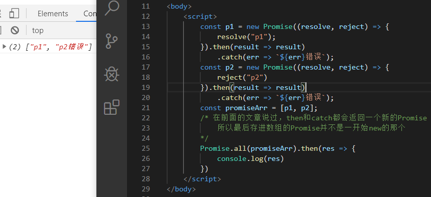

> 前言
>
> 本篇文章为个人对Promise的总结，如有错误请及时指正！！


# 前置知识

## 什么是Promise？

Promise是异步编程的一种新的解决方案，比以往通过回调函数和事件来解决异步操作更加强大。

## 什么是回调函数？

可以理解为，当完成一些事情后，再去做的另一些事情，这需要传入一个函数作为参数去执行


## 什么是事件？

事件其实就是发生了一个事情，然后相应的去触发某个函数。当然事件也是一个异步操作，它不会立即执行，而是等待某个条件满足后才去执行


## 什么是回调地狱？

某个异步操作需要等待之前的异步操作完成才能执行，不管你使用的是事件还是回调函数，都会进行嵌套，**导致代码难以阅读**

### 回调地狱的演示

注意：下面代码只为了演示回调地狱，并无实际意义

- 读取文件

  pathOne.txt中存着pathTwo.txt的路径，pathTwo.txt存着pathThree.txt的路径，要获取pathThree中的内容，就需要获取前面的内容

```js
// 以下代码只为模拟回调地狱，并无实际意义
const fs = require("fs");
fs.readFile("./pathOne/pathOne.txt", "utf-8", (err, data) => {
    console.log("pathOne：" + data);
    if(data) {
        fs.readFile(data, "utf-8", (err, data) => {
            console.log("pathTwo：" + data);
            if(data) {
                fs.readFile(data, "utf-8", (err, data) => {
                    console.log(data)
                })
            }
        })
    }
})
```


- ajax模拟回调地狱

  要找到id为3的女生，就需要先找到班级列表，并看是否有符合的班级，之后再发送请求去找数据

​	注意：为了方便演示，这里使用jq的ajax方法


- 事件的回调地狱

  只有点击前一个按钮，后一个按钮才会绑定事件


注意：回调地狱可能会出现一个类似三角形的样子，如果看到，那么就需要注意是否已经陷入回调地狱了

## 简述事件循环(Event Loop)

简单介绍一下事件循环的几个概念，免得下面阅读遇到困难(虽然没提到多少)

执行栈(call stack)：用于存放各种语句的执行环境，每一条或一块语句执行之前，都会被加入到执行栈中，执行语句前创建执行栈，然后把语句加入，执行完成后就销毁该执行栈

宏任务队列(Macrotask Queue )： 比如计时器回调、事件回调等异步函数都会进入宏队列

微任务队列(Microtask Queue)：Promise产生的回调都会放进该队列

最初执行栈中的内容，其实就是script标签中的代码，它会按顺序进行执行，如果碰到同步代码会直接执行，碰到异步代码的统一丢到事件队列中，等到执行栈中的不存在任何东西的时候，它会先看看事件队列中的微队列是否存在待执行的语句，如果存在就先拿来执行了，等到微队列中所有的语句执行完毕后，才会看宏队列是否存在待执行的语句，然后再把宏队列的东西拿出来执行

微队列的执行顺序是否会早于宏队列，看下面这个例子


# Promise的基本使用

## 三种状态

- pending：进行中
- fulfilled：已成功
- rejected：已失败

## 特点

### 对象的状态不受外界影响

只有Promise自己才能决定最终的状态，任何操作都无法进行干扰

### 状态不可逆

状态只要发生了改变，就已经定死了，不能进行任何改变。

我们只能从pending推向fulfilled或pending推向rejected，不能从pending推向fulfilled再推向rejected


## 基本使用

Promise是一个构造函数，我们可以用它来生成Promise实例，并且该构造函数接受一个函数作为参数，这个函数拥有两个参数，分别为resolve和reject，它们是由**js引擎提供**给我们的**一个函数**

### 创建Promise实例

~~~js
const promise = new Promise((resolve, reject) => {
    if(Math.random() < 0.8) {
        resolve("我可真帅")
    } else {
        reject("我还是帅");
    }
})
~~~

- resolve函数的作用

  将当前Promise实例的状态从pending推向fulfilled

- reject函数的作用

  将当前Promise实例的状态从pending推向rejected

由于resolve和reject都是一个函数，所以我们可以向它们**传递一个参数**，作为该异步操作的结果，那这个结果我们要在哪里获取呢？？？往下看呗


### then方法

then方法接收两个回调函数作为参数，分别为thenable函数和catchable函数，thenable函数是当状态为fulfilled的时候调用，catchable函数是当状态为rejected的时候调用，并且catchable函数是可选的

~~~js
const promise = new Promise((resolve, reject) => {
    if(Math.random() < 0.5) {
        resolve("fulfilled")
    } else {
        reject("rejected")	// 通常为一个异常对象Error
    }
})

promise.then(res => {
    // thenable函数
    console.log(res)
}, err => {
    // catchable函数
    console.log(err)
})
~~~


<span style="color:red;">注意一下</span>

1. thenable和catchable都是异步函数，所以它们会被加入到事件队列中等待执行(是放在微队列中)


2. Promise构造函数中的函数是一个同步函数，它会立即执行


3. 一个Promise是可以对应多个处理程序的


在pending阶段，如果发生未捕获的错误或者主动调用reject，都会将状态推向至rejected，并被catchable捕获

- 错误未捕获


- 捕获错误


- 主动调用reject


细节补充：

try...catch，只能捕获同步的错误，捕获不了异步的错误，碰到需要注意


解决方法：

- 异步函数中内嵌try...catch


- window.onerror


# Promise的串行执行

如果后面的Promise需要用到之前Promise的结果时，就需要让Promise串行执行

Promise中的then或catch方法，都是会返回一个全新的Promise对象


## 新的Promise的状态的特点

- 如果Promise的状态为pending，那么新的Promise状态就为pending


为什么promise1的状态为pending？
​	虽然promise执行了resolve后把自己的状态推向resolved，但是因为promise1的状态**需要等待promise有了处理结果(相应函数运行完)，才会进行状态改变**。由于thenable和catchable是异步函数，会被加到事件队列中，而这里log函数又是同步执行，所以log函数在执行的时候，异步函数还未执行，那么就意味着没有得到处理结果，这时候promise1还处于等待处理结果的状态，所以状态就是为pending


​	<span style="color:red">误区</span>：除了pending以外，别以为上一个Promise的状态就一定能决定新生成的Promise的状态


- 如果**当前Promise**的状态已经为resolved或者rejected，那么会运行**后续相应的处理函数**(thenable或者catchable)，并将(后续的)函数的返回值作为状态数据，应用到新的Promise中。


​	**注意一下**，上一个Promise的状态，只会导致它自己的then方法执行哪个函数的问题，并不会导致下一个Promise(thenable和catchable返回的Promise)的then方法执行函数的问题，也就是说then执行不出错，那么then返回的Promise状态都是resolved


## 小栗子

下面这些代码输出的结果是什么？

1. 

~~~js
const promise = new Promise((resolve, reject) => {
    resolve(2)
})
const promise1 = promise.then(res => {
    return res * 2
}, err => {
    return err * 3
})
promise1.then(res => {
    console.log(res * 2)
}, err => {
    console.log(err * 3)
})
~~~

2. 

~~~js
const promise = new Promise((resolve, reject) => {
    throw "吴彦祖";
})
const promise1 = promise.then(res => {
    return "Wick好帅";
}, err => {
    throw `${err}好帅`;
})
promise1.then(res => {
    console.log(res)
}, err => {
    console.log(err, 30)
})
~~~

3. 

~~~js
const promise = new Promise((resolve, reject) => {
    resolve("摊牌了");
})
const promise1 = promise.then(res => {
    return `${res}，其实我就是吴彦祖`;
}, err => {
    return `,我不是吴彦祖`;
})
promise1.then(res => {
    console.log(res)
}, err => {
    console.log(err)
})
~~~


1. 第一个为：8


2. 第二个为：吴彦祖好帅

   


3. 第三个为：摊牌了，其实我就是吴彦祖


# 解决前面的回调地狱

## 读取文件


## ajax回调地狱


## 解决事件的回调地狱


# Promise相关API

## 实例成员

Promise创建的实例对象能直接使用then和catch等方法，说明这些方法存在于Promise的原型上

### Promise.prototype.then()

前面说过了，这里不做介绍了！

### Promise.prototype.catch()

前面也说过了，那这里就看一些新的东西。

catch是发生错误时调用的函数，并且是`.then(null / undefined, rejection)`的别名

1. 错误的"冒泡性质"

   错误会泡泡一样，向后传递，直到被捕获为止

   

2. 不建议把catch作为then的第二个参数

   

   
   
   一起来看一个问题，是关于`Uncaught (in promise)`的问题
   
   当Promise抛出了错误，如果未被捕获，这时候就会报出这个错误


​		那现在解决这个问题的方法就是捕获这个错误，那来看下下面这些解决的方法
​		方式一：then(thenable, catchable)
​			嗯，捕获了，问题解决了

​		方式二：实例方法catch
​			同样的也捕获了错误


​			那下面这是为啥？明明我catch了啊，为啥抓不到呢？
​			在前面说过，Promise可以对应多个处理程序，你catch中抓到了，那then中呢？并没有对吧


​			加一个catch即可


3. 吃掉错误

   Promise抛出的错误，并不会对外部代码造成影响，该运行的还是会运行

   


### finally

ES2018引入的一个标准，不管Promise最后状态如何，都会执行这个语句，并跟finally声明的顺序有关。类似`try...catch`的finally关键字

- 声明顺序


- resolved


- rejected

  finally方法不接受任何参数，thenable和catchable都会走到finally，你根本没法知道它们最终的状态


同样的，finally也会返回一个Promise


## 静态成员

### Promise.resolve([args])

根据参数不同，返回的东西也会不同

1. 参数为Promise

   不做任何处理，原样返回

   

   注意：虽然不做任何处理，但是状态数据还是你自己定的

2. 不携带参数或参数为一个原始值

   不管怎么样，都会返回一个状态为resolved的Promise对象，并且状态数据是我们定义的

   

   

### Promise.reject(args)

该方法返回一个rejected状态的Promise，并且状态数据是我们传递进去的


### Promise.all(iterable)

参数为一个迭代器(这里可以先认为是一个数组)，并返回一个新的Promise对象。数组中必须都为Promise对象，如果有不是的，会自动调用Promise.resolve转换成Promise对象，并且状态为resolved。

all会返回一个新的Promise对象，那什么时候会触发这个新Promise对象的thenable和catchable呢？

根据状态的不同，分为两种情况

1. 数组中所有的Promise实例的状态为resolved时

   all有全部的意思，就是说数组中所有Promise实例的状态为resolved的时候，就会触发thenable函数，thenable的参数为一个数组，它们是由所有Promise实例的状态数据构成

   

   

2. 当数组中的Promise实例出现rejected状态时

   只要出现了rejected，就不会触发all的thenable函数，而是触发catchable函数，catchable函数的参数为第一个出现rejected状态的Promise实例的状态数据

   看栗子，可能有点表达的有点绕

   


说一下数组中rejected的错误情况

如果存进的数组中的Promise自己带有catch，那么如果出错了，就不会触发all方法的catch。如果自己没有catch，那么才会触发all方法的catch




### Promise.race(iterable)

参数为一个迭代器，并且返回一个Promise对象

race有竞赛的意思，那么可以理解为，这是一场跑步比赛，一开始所有人都在准备(pending)，直到哨响，有人率先冲了出去(改变状态)，领先的肯定只有一个，所以race也是只会触发一次，之后会根据状态相应的触发race的thenable或catchable


# 解决NodeJS中MySql异步查询问题

执行环境：

Node v12.13.1

webstorm

Express搭建服务


问题发生情景：

前几个月的时候，我用Node写博客的时候碰见了一个查询数据库的问题(好像是给用户添加权限的时候，太久了记不清了)，我当时并没有想那么多，就像我在Java中通过selectByWhere(String sql)或selectOne(Integer)等方式来简化代码一样，于是顺理成章写了代码，后面发现并不可取，根本拿不到查询出来的值

于是。。我当时采取了下面这种方法(现在想想真是脑子有病= =。。。)

- 在query方法外部声明一个临时变量，等查询结果出来后给它赋上(当时并没有意识到是异步查询)，并作为整个函数的返回值

  这能拿到数据真是有鬼！！！


然后我就发现mysql是异步查询，所以当时我就用async和await来写，那这篇文章讲的是Promise，那就用Promise来包装一下，async和await就留着给下篇文章讲吧

使用Promise进行包装后，效果很容易就实现了！！！


# 参考文章

《深入理解ES6》

[阮一峰ES6](https://es6.ruanyifeng.com/#docs/promise)

