# 前置知识

## 设计初衷

为了创建对象的私有成员


## 新增数据类型

在ES6中，引入了一种新的原始数据类型，那就是Symbol，符号，代表独一无二的值，有了它的加入，原始数据类型就有6种了

1. Boolean
2. String
3. Number
4. null
5. undefined
6. Symbol


# 创建Symbol

直接使用Symbol(["描述"])，就可以获取一个Symbol类型的数据。它的参数只起一个描述作用，还有就是做区分的，如果一直进行Symbol()创建，在用的时候，是可能分不出来各个Symbol的作用的。

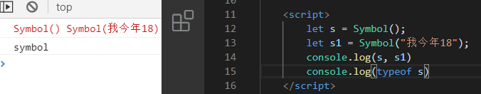

参数可不只是支持基本数据类型哦，你要放进去一个对象也行啊，它会自动调用toString()进行转换

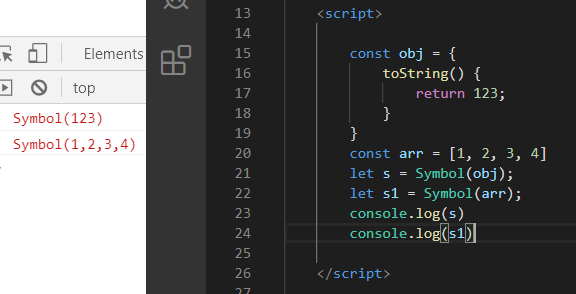


# Symbol的特点

创建挺简单，特点就有点多了

## 独一无二

每一个创建的Symbol都是独一无二的

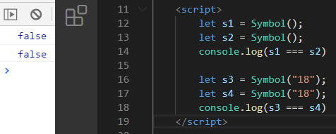

## 不能new

在Symbol内部会阻止你显示创建一个Symbol的包装器，在ES6中，原始数据类型无法再创建一个显示的包装器对象了，而现有的包装器对象，new Boolean、new String和new Number，因为遗留原因仍然可创建


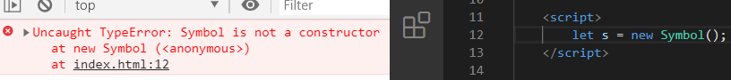

要是真想创建Symbol包装器对象，那么请使用`Object()`函数

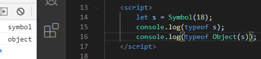


## 没有直接量

像字符串，对象，数字等，都有直接量，就它没有

```js
let s = "我今年18";
let age = 18;
const obj = {};
```


## 无法被隐式转换

它的显示转换，分两种

1. String()
    只能通过String()，不能new String()哦

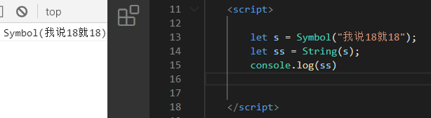

​		要转String的话，toString()也是可以的

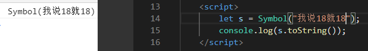

2. Boolean()和new Boolean()

   如果要转Boolean，都是好使的

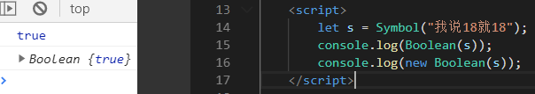


无法隐式转换，指的是那些字符串拼接、数学运算等七七八八的场景

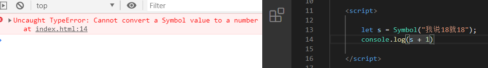
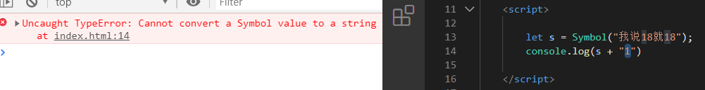

## Symbol属性
Symbol属性就是它可以作为对象的属性，在最初，开发者经常用它来创建私有成员，因为独一无二嘛，你外面个根本拿不到一样的Symbol出来

- 私有属性
  要私有的话，方法很多，在提案路上的就有一个`#`，添加它后，属性和方法就都可以私有

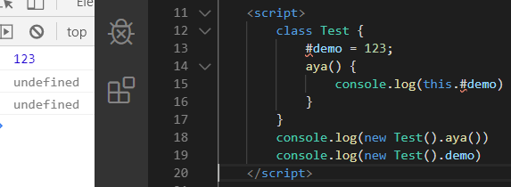

  	还有别的方法，自行Google吧!

 	我说一个方法，就是利用立即执行函数和闭包，做一个私有属性，这样外面就访问不了了

 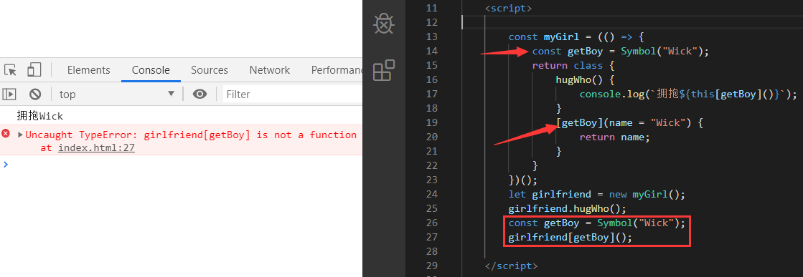

为什么属性两边加上`[]`？

这是ES6引入的一个属性名表达式(计算属性)，用于动态获取属性名，讲白就是你可放变量名在里面，之后通过变量去调

 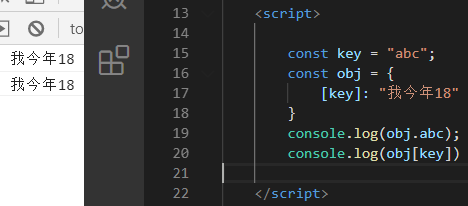

- 不可枚举

  记不记得有一个`Object.getOwnPropertyNames(obj)`属性，可以获取对象的所有属性(枚举和不可枚举)，我们拿它试试

  找不到找不到，这个属性根本拿不到Symbol，这个官网也有说，除了Symbol都可


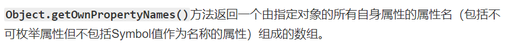


- 读取Symbol
     最后再来一个，私有属性的Symbol，也不是完全隐藏的，要获取还是可以的
     通过Object.OwnPropertySymbols(obj)即可，它会找到给定的对象上的所有Symbol属性

	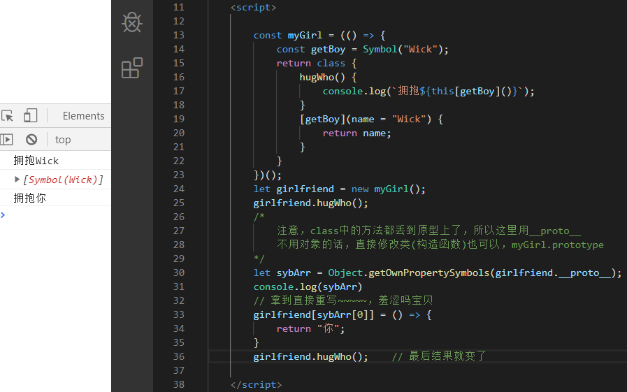


# Symbol的共享体系

Symbol的一个静态方法，Symbol.for("描述")，它接收一个参数并创建一个Symbol，之后会去比对它的容器(存Symbol的地方)，看看有没有一模一样的，如果有，就直接返回，否则新创建一个。

emmm，这听着像不像单例模式？？不是好像，分明就是啊宝贝们

是单例，那好说啊，我们来简单模拟下看看效果

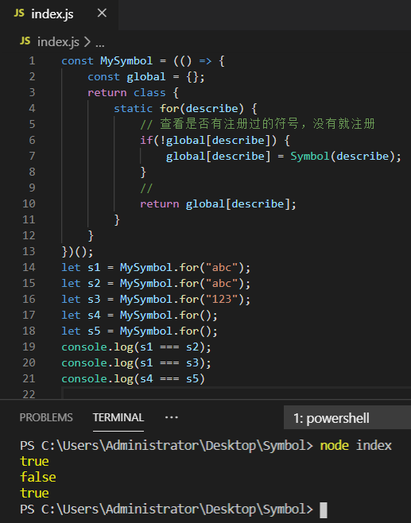

模拟完，那我们看看怎么用吧

很简单对吧，跟上面模拟的差不多

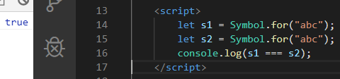


Symbol()和Symbol.for()的区别？

Symbol()和Symbol.for()都会生成新的Symbol。它们的区别是：Symbol()未在全局环境(Symbol的容器)中注册，而Symbol.for()有在全局环境中注册，所以有注册的相当于就单例了，有注册的话直接就返回了，没注册就新创建，而Symbol()每次都是创建新的。


Symbol.keyFor(Symbol)

该方法会返回一个在全局环境注册过的Symbol的key

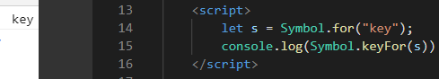

未经注册的Symbol，是无法获取的

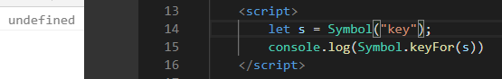


# 知名符号well-known symbol

ES5的中心主旨是将JS中一些"神奇"的部分暴露出来，并详尽定义了这些开发者们在当时模拟不了的功能。而**ES6延续了这个传统**，通过**在原型链上定义与Symbol相关的属性来暴露更多语言内部的逻辑**

这里的神奇和暴露，是什么意思？

就是在ES5或6以前(根据提出的API来说)，有很多东西很神奇，**使用一些API**，就可以**达到某些效果**，而你连这些效果怎么做的你都不知道，你也没办法插手去做些什么，反正用了就好使，这个神奇的东西，并不存在于JS，只要有出现类似的情景，都可以称为"神奇"，比如Vue。而暴露呢，就是暴露出来让你操作啊

记得在大一的时候，有一个小东西折腾了我好久，那就是delete关键字，可以删除表达式，知道后，一顿操作，然后惊了，我嘞个**，为啥删了这个属性就好使，那个就不好使了，明明都是属性啊。。。在很久之后我碰到了ES5提出的Object.defineProperty()。。虽然在学的时候ES5早出了，只是我不知道而已(真是菜的真实)

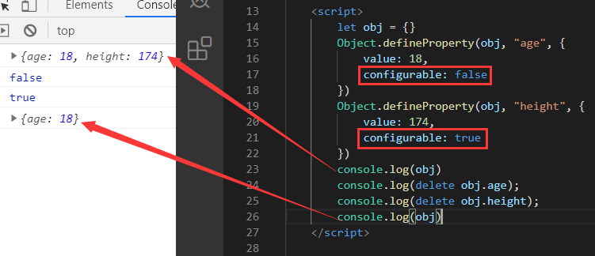

注：既然暴露出来供我们修改，但是别动不动改个东西，以免最后运行结果不符合我们的预期，记得谨慎操作鸭!


## Symbol.hasInstance

先来看看`instanceof`关键字有啥用吧，它能检测构造函数的prototype属性是否在某个对象的原型链上。就是看看对象是不是它孩子

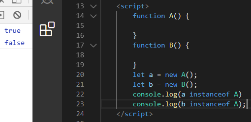

~~~js
a instanceof A;
// 上面代码等效于下面这段代码
A[Symbol.hasInstance](a);
~~~


概念：一个在执行instanceof时调用的内部方法，用于检测对象的继承信息，该方法在Function.prototype中定义，所以所有的函数对象都继承了instanceof属性的默认行为。

既然能修改JS内部逻辑，那想怎么改就怎么改，岂不是美滋滋，来试试？

唉，咋不行？没效果啊

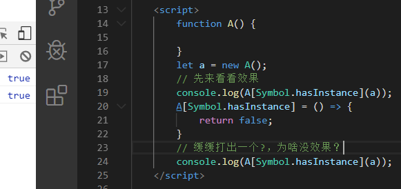

其实，为了**防止**Symbol.hasInstance**被意外重写**，所以该方法被定义为不可写，不可配置，并且不可枚举。

如果想定义一个**无实例的例子**，我们只要把Symbol.hasInstance硬编码的返回值定为false。

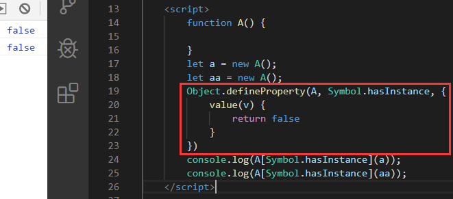

不是说方法不可重写，为啥又可写了？

只有通过Object.defineProperty()方法才能重写一个不可写属性，这个属性挺重要的，学习的时候碰了好多次，我到时候抽个时间总结一下吧

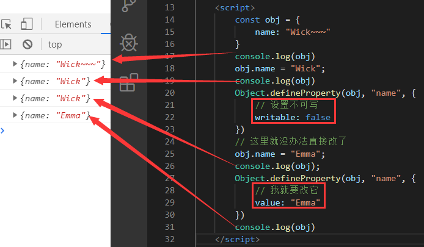

注意：如果要触发Symbol.hasInstance调用，instanceof的左操作数必须是一个对象，否则一直返回false，别想着包装类了，它是不会走包装类过程的。

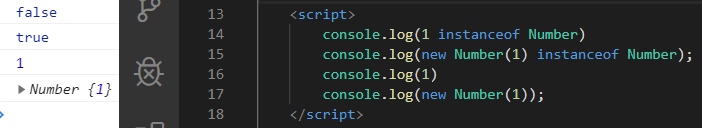


## Symbol.isConcatSpreadable

概念：属性值为bool，决定了concat的数组，是否被独立添加到concat最后返回的数组中，如果值为true(默认)，则表示对象有length属性和数字键(索引)，那么就独立添加到concat返回的数组中

在最初使用concat的时候，它只有一种情况，凡是对concat传入了数组，都会将它们拆开，然后进行拼接，最后再返回。

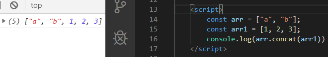

注：这个操作是ES6之前没办法进行控制的

在ES6中，我们给它添加Symbol.isConcatSpreadable属性为false，那么就不会拆开后再拼接了，而是直接拼在一起

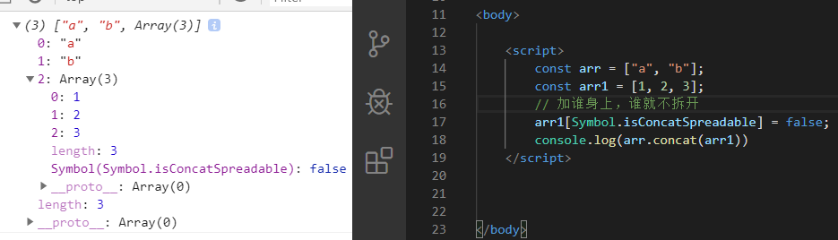

拼接对象


## Symbol.toPrimitive();

概念：可以将对象转化为基本数据类型的方法，只要把对象转成原始数据类型，就会触发这个方法，并返回该对象的原始类型值

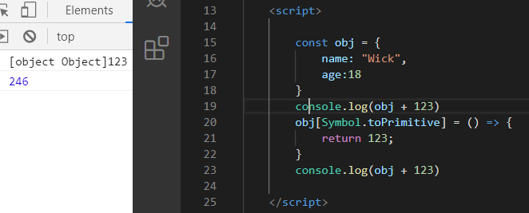

只要对象转换至原始类型，就会触发Symbol.toPrimitive方法并传入`hint`(JS引擎提供)作为参数，这个`hint`被称为类型提示。

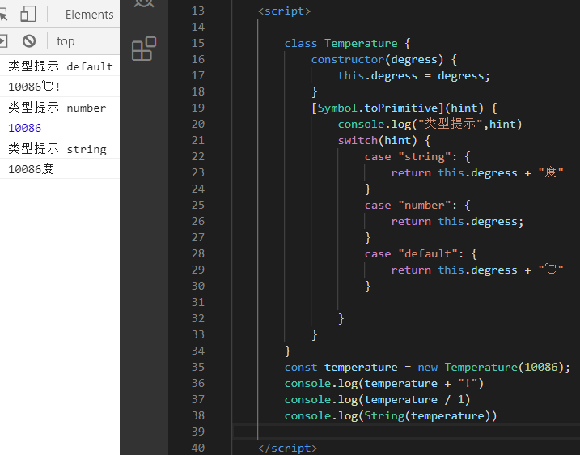

类型提示的三种情况

1. 数字模式number
   	该场合需要转成数值的时候，hint为number

   类型转换特点：
   
   1. 调用valueOf()方法，如果结果为原始值，则返回。
2. 否则，调用toString()方法，如果结果为原始值，则返回。
  
   3. 如果再无可选值，则抛出错误
   
2. 字符串模式string

   ​	该场合需要转成String的时候，hint为string

   ​	类型转换特点：

   1. 调用toString()，如果结果为原始值，则返回
   2. 否则，调用valueof()方法，如果结果为原始值，则返回。
   3. 如果再无可选值，则抛出错误

3. 默认模式default

   ​	该场合既可以转数值，也可以转字符串，hint为default

   ​	模式转换特点同number


## Symbol.toStringTag

概念：可以用来修改Object.prototype.toString的返回值`[Object ????]`后面的东西

只要让对象直接访问Object.prototype.toString()，那么都会返回一个`[Object xxxx]`的东西，比如下面这个

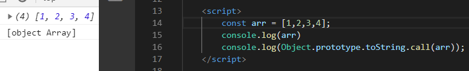

在以前，我们没办法干涉这个东西，现在我们牛逼了

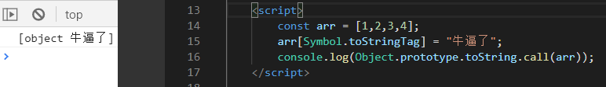


还有好多知名Symbol，请移步MDN吧!

# 参考文章

《深入理解ES6》

[MDN——Symbol](https://developer.mozilla.org/zh-CN/docs/Web/JavaScript/Reference/Global_Objects/Symbol)

[阮一峰——Symbol](https://es6.ruanyifeng.com/#docs/symbol)