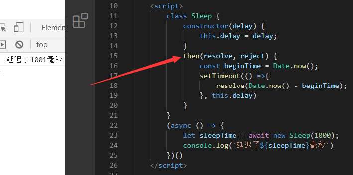

# 前置知识

在阅读本文章前，你可能需要先了解以下知识

- 生成器Generator
- Promise相关知识


## 什么是语法糖

就是给计算机语言新添加某个语法，并且这个语法对原来的代码没有任何影响，**只是为了简化操作**

详细请移步百度百科：[语法糖](https://baike.baidu.com/item/%E8%AF%AD%E6%B3%95%E7%B3%96/5247005?fr=aladdin)

比如以下几种：

对象中函数的简写：

~~~js
const obj = {
    test() {
        
    }
}
~~~


可计算变量名：

~~~js
let demo = "abc";
const obj = {
    [demo]() {
        
    }
}
~~~


class关键字


## Generator的语法糖

在ES8(ES2017)引入了一个关键字，`async`，它使得异步操作变得更加方便，在该关键字出来之前，开发者们使用Generator来解决异步问题，并且效果很好，于是ES8引入了async关键字作为Generator的语法糖，其目的就是简化异步操作。

```js
// 比如下面这个示例代码(无意义)
// Generator
function* controlAjax() {
    let r1 = yield ajax(url,fn);
    let r2 = yield ajax(url,fn);
    let r3 = yield ajax(url,fn);
    // some code...
}
let it = controlAjax();
it.next();
it.next();
it.next();

// async、await
async function controlAjax() {
	await ajax(url,fn);
	await ajax(url,fn);
	await ajax(url,fn);
    // some code...
}
controlAjax();
```


## async函数对Generator函数的改进

### 内置执行器

co模块：Generator函数的执行必须依靠执行器(next)，否则无法执行，而co模块的出现，我们只需要往它的函数中传入一个Generator，它就能自动执行。

那来康康async函数，只要一调用它，它就会立即执行


### 更好的语义

`async`和`await`，比起`*`和`yield`，语义更清楚。`async`表示函数里有异步操作，`await`表示后面的表达式需要等待才能有结果


### 更广的适用性

`await`后面的，可以是Promise对象或原始类型的值，如果是原始类型的值，那么会调用Promise.resolve进行转换


### 返回值是Promise

`async`修饰的函数，返回值都是Promise，这比Generator函数的返回值是Iterator更加方便，我们可以直接调用then进行指定操作


# 基本概念与使用

## async

async只能用于修饰函数(是函数就OK)，并且是需要放置在函数之前的。一旦被修饰，那么该函数的返回结果就变成了Promise对象


在前面说过语法糖，也举过栗子，都说语法糖是简化操作，那async到底哪里简化了Promise？

我们在写Promise操作的时候，经常会把Promise作为一个函数的返回值，如果函数很多，我们就要一直 `return new Promise(...)` ，这样非常麻烦，既然都要返回Promise，如果有简化操作，岂不是很香嘛？那解决办法就是async~

~~~js
async function test() {
    return 123;
}

// 上面的代码相当于写成这样
function test() {
	return new Promise((resolve, reject) => {
		resolve(123);
    })
}
~~~


## await

**await必须出现在async修饰的函数中**，并且**只能用在表达式之前(这个范围就巨大了！)**。正常情况下，这个表达式是一个Promise对象，如果不是，会**通过Promise.resolve自动转化**，之后会**在then方法中拿到该Promise的状态数据**。但是在用await的时候，我们根本不用去写then，它会自动帮我们获取状态数据，所以await其实就是then方法的一个语法糖而已。

```js
async function mayi() {
    return "蚂蚁雅黑";
}
async function test() {
    console.log(await mayi());
}
test();

// 上下代码等效

function mayi() {
    return new Promise((resolve, reject) => {
        resolve("蚂蚁雅黑")
    })
}
function test() {
    return new Promise((resolve, reject) => {
        mayi().then(res => {
            console.log(res)
        })
    })
}
test();
```


## 栗子

先看下上篇Promise文章的例子，用Promise解决异步调用


我们这里用`async`和`await`进行下优化，此时铁汁们发出疑问，不就没写了then了嘛，还不是和上面代码没差多少，哪里就优化了？


上面的代码添加了`async`和`await`，只是让代码更好阅读，更像一个同步的代码，但是这不是重点。

重点是我们在敲代码的时候，难免会碰到异步函数，比如上面的query，又或者是setTimeout等方法，都可能存在回调函数，而你在回调函数里想调用return来改变Promise的状态是不可能的，你只能通过resolve或者reject进行改变，那这个resolve和reject哪里来？只有自己`new Promise()`才能获取的到，在这个时候async根本没办法帮我们做些什么。所以有些时候，避免不了一些问题，我们还是得老老实实手动创建一个Promise。

来康康下面这个`setTimeout`的栗子。

不用想，下面这样肯定是不行的。那问题来了，我就想等待1.5s秒之后再改变状态怎么办？


只能对setTimeout的回调进行操作了

比如这样


再比如这样


# 语法

## 返回Promise对象

`async`函数内部return语句返回的值，会成为then方法回调函数的参数


`async`函数内部抛出错误，会导致返回的Promise对象变为reject状态。抛出的错误会被`catch`方法所捕获


## Promise状态变化

`async`函数返回的Promise对象，必须等到内部所有的`await`后面的Promise执行完毕，才会发生状态改变，然后去调用then方法，除非遇到return语句或抛出错误。

先碰到return，推向resolved状态，后面语句未执行完


先抛出错误，推向rejected状态，后面语句未执行完


Promise执行抛出错误


## await命令

`await`命令后面如果是一个`thenable`对象(即定义then方法的对象)，那么`await`会将其等同于Promise对象。

看栗子




有时候我们希望某个异步操作失败了，也不要停止后面的异步操作，这有两种方法

方法一：`await`放入`try...catch`


方法二：`await`后的Promise跟上一个catch


## 注意事项

如果多个`await`命令后面的异步操作，之间没有任何关系，那么最好让它们同时触发，以节省程序运行时间

先康康默认执行效果


再康康同时触发的效果

写法一：await Promise.all


写法二：先让Promise去执行，用await去拿返回结果


# async函数的实现原理

async函数的实现原理，就是将Generator函数和自动执行器(spawn)，包装在一个函数里

```js
async function fn(args) {
    // some code
}

// 上下代码等效

function fn() {
    return spawn(function* () {
        // some code
    })
}
```

<span style="color: red">看颜色就知道spawn有多重要</span>

```js
// spawn函数实现代码
function spawn(genF) {
  return new Promise(function(resolve, reject) {
    const gen = genF();
    function step(nextF) {
      let next;
      try {
        next = nextF();
      } catch(e) {
        return reject(e);
      }
      if(next.done) {
        return resolve(next.value);
      }
      Promise.resolve(next.value).then(function(v) {
        step(function() { return gen.next(v); });
      }, function(e) {
        step(function() { return gen.throw(e); });
      });
    }
    step(function() { return gen.next(undefined); });
  });
}
```


# 参考文章

[阮一峰async、await]()


