# 前置知识

## 什么是迭代器(iterator)？

可以理解为一个特殊的对象，它是专门为迭代过程设计的一个专门的接口

迭代器具有以下的特点

- 具有next()方法

  所有迭代器对象，都必须带有next()方法

- 调用后返回一个结果对象

  调用next()方法后，会返回一个结果对象，这个结果对象有两个属性

  1. value：下一个将要返回的值
  2. done：bool类型，表示遍历是否结束，如果结束，返回true
  
- 内部指针

  迭代器内部会保存一个指针，用来指向数据结构中第N个成员。每调用一次next，就会导致指针指向下一个成员

  

## 循环语句的问题

写代码这么久，循环语句肯定写过，对吧，有没有想过会有什么弊端？

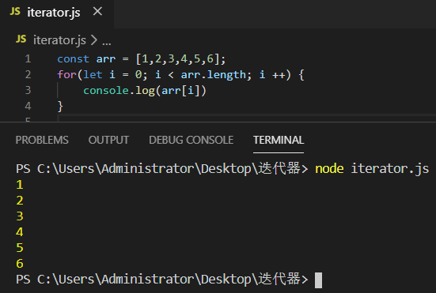

上面代码，通过i索引来访问数组，如果i不大于length，那么i就+1。这个没啥问题，但是当循环进行了嵌套呢？这会大大增加代码的复杂度，可能分析代码到一半，被人打断了思路，那么问题就来了，诶，我上一个是多少来着？？

迭代器的出现，就是为了消除这种复杂性并减少循环出错。


# 迭代器(Iterator)

前面说了迭代器的特点，要有next方法，调用后又要返回一个结果对象，还要有内部指针，那来看看这个要怎么写吧

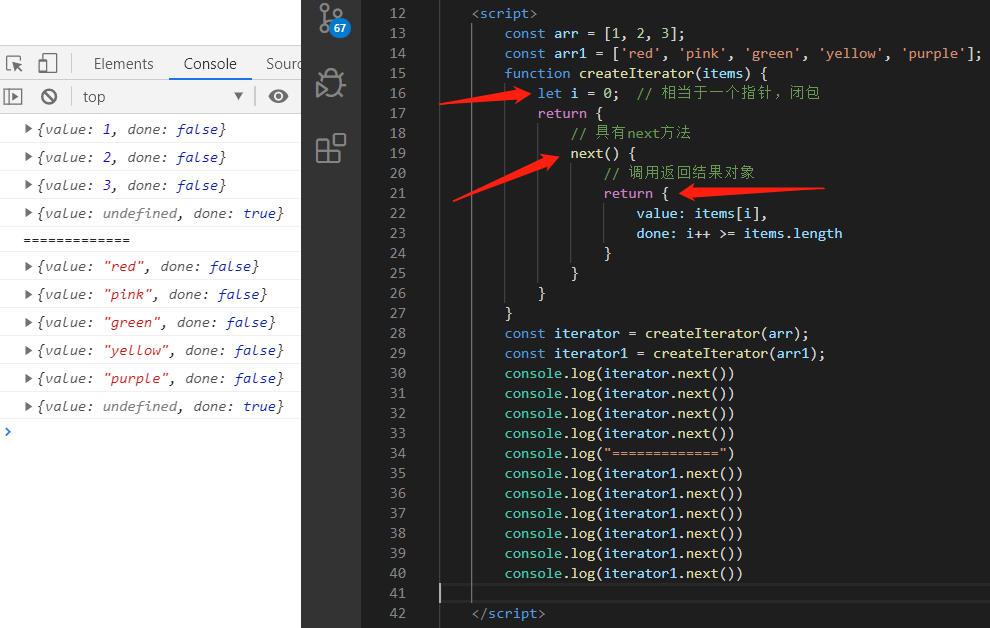

这个i，可以认为是一个内部的指针，由于有返回值的原因，所以和该函数的AO(执行期上下文对象)产生了闭包。但又因为是原始值，所以你根本没办法操控它。

这里把它换成引用类型，只是为了看看闭包效果，这代码没有任何意义，也没人会这样写

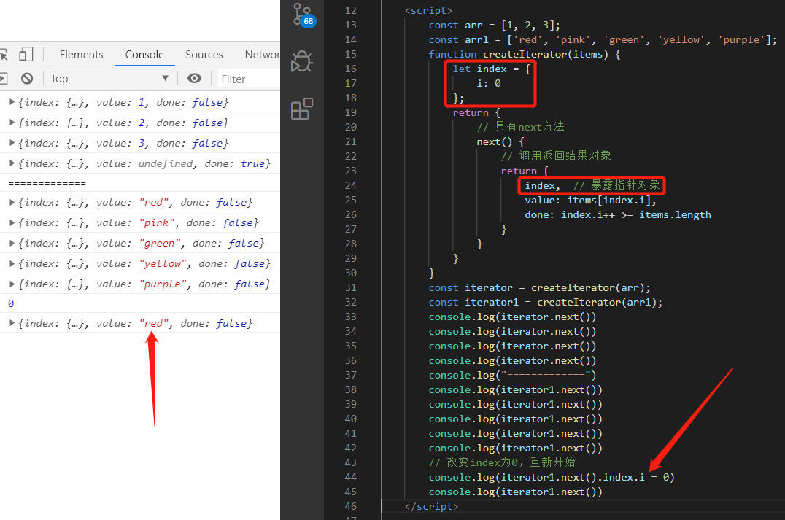


## 迭代过程

1. 创建指针对象，指向当前数据结构的起始位置
2. 调用一次next方法，就会让指针指向数据结构的下一个位置
3. 不断调用next方法，直到指向数据结构的最后一个位置


## 使用while进行迭代

有时候我们会想把整个数据结构都进行遍历，这就会用到循环。所以就算是迭代器，也要手动next，否则无法进行迭代，所以还是要依靠循环

```js
const arr = [1, 2, 3, 4, 5, 6, 7, 8, 9, 10];
function createIterator(items) {
    let i = 0;
    return {
        next() {
            return {
                value: items[i],
                done: i++ >= items.length
            }
        }
    }
}
const iterator = createIterator(arr);
let it = iterator.next();
while(it.value) {
    console.log(it.value)
    it = iterator.next();
}
```

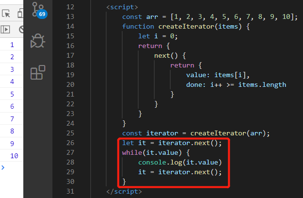


## 数据结构解耦

Iterator只是把接口定义在数据结构之上，所以迭代器和需要遍历的数据结构是可以分开的，或者说是可以模拟出数据结构。所以就算不提供数据结构，迭代器依然可以使用。

```js
function createIterator() {
    let i = 0;
    return {
        next() {
            return {
                value: i ++,
                done: false     // 永远不会结束
            }
        }
    }
}

const iterator = createIterator();
console.log(iterator.next());
console.log(iterator.next());
console.log(iterator.next());
console.log(iterator.next());
console.log(iterator.next());
console.log(iterator.next());
console.log(iterator.next());
console.log(iterator.next());
```

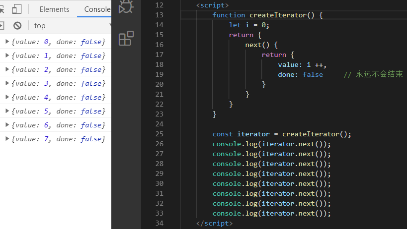

这个标题的解耦，我只是想表达，迭代器并不一定要完全依赖数据结构，就算没有数据结构，它依然可以做事情。就有点像是现在的快递驿站，你完全不用知道它内部到底是怎么存储包裹(比如第几区第几列)，你去拿快递，提供你的手机号，管理员会帮你找包裹，就有点像代理的感觉，帮着你进行管理，你并不要操心什么(存储结构)。


## 可迭代协议和迭代器协议

### 可迭代协议

可迭代协议允许JavaScript对象去定义或定制它们的迭代行为。为了变成可迭代对象，就必须实现`@@iterator`方法，**意思就是某个对象或它的原型链上必须有一个Symbol.iterator属性，才能对其进行迭代**。

Symbol.iterator的值为一个迭代器创建函数(create iterator)，执行它会得到一个迭代器对象

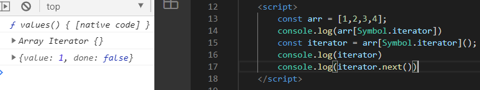


一些内置对象都内置了这个Symbol.iterator属性，比如Array、String、map等

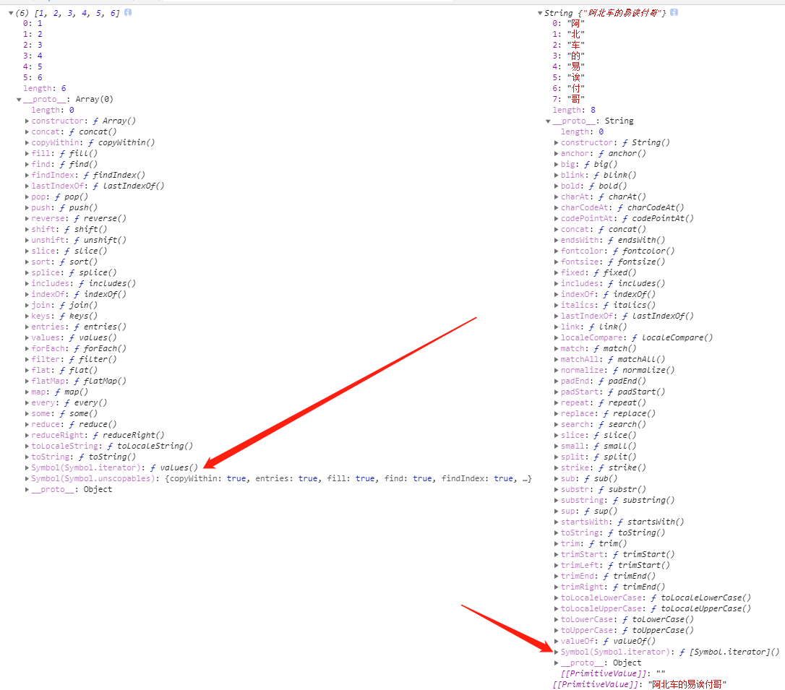

Object是例外，它没有`Symbol.iterator`属性，是因为不知道要先迭代哪一个属性，所以我们无法直接进行操作，如果要让它可迭代，我们就必须手动给它定义一个规则。

```js
const obj = {
    [Symbol.iterator]() {
        return {
            next() {
                return {
                    value: 1,
                    done: true
                }
            }
        }
    }
}
const iterator = obj[Symbol.iterator]();
console.log(iterator.next());
```

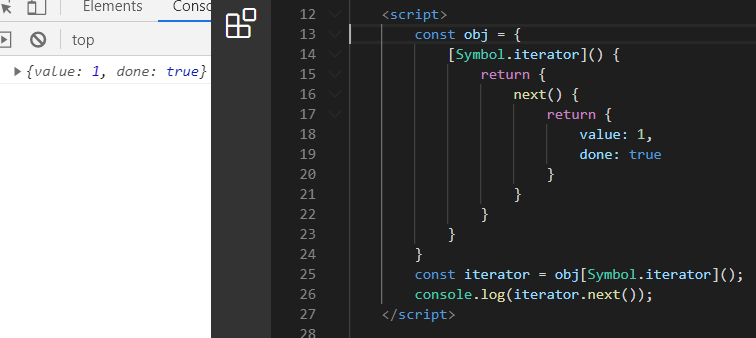


只要具有[Symbol.iterator]属性，就说明某个对象可以进行迭代，那我们可以写一个函数来判断一下

```js
function isIterator(obj) {
    return typeof obj[Symbol.iterator] === "function"
}
```

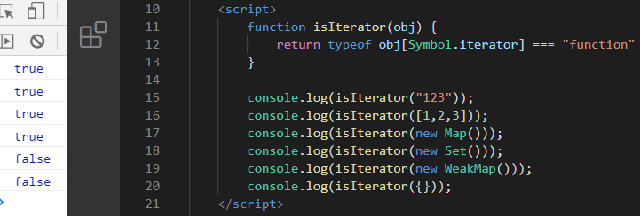


### 迭代器协议

这个就直接看mdn定义的吧，很简单

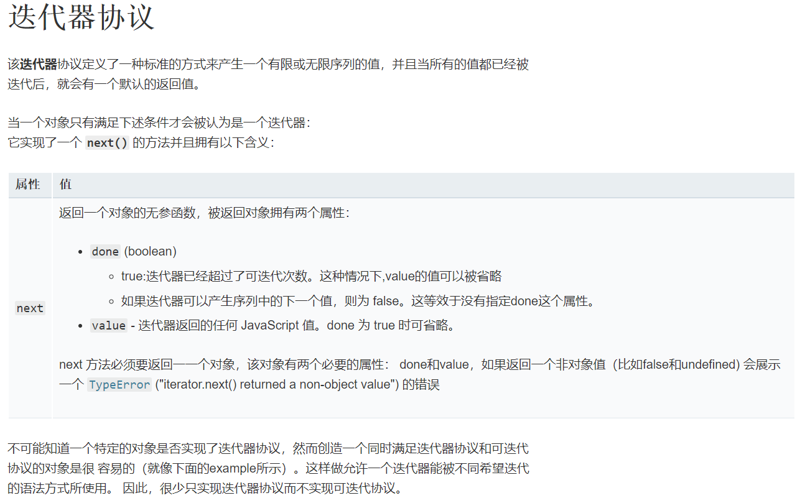


### 数组迭代

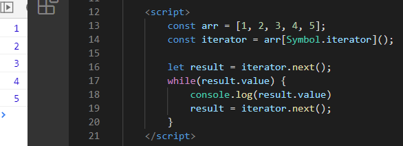


### 迭代伪数组

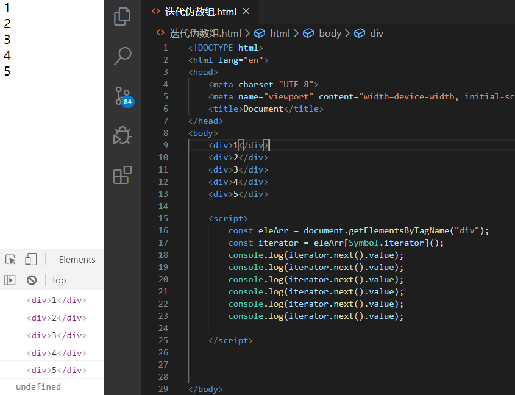


## for...of循环

我们对对象和数组都进行了迭代，会发现它们迭代的模式都相同(都要一直next)，所以在ES6中给我们提供一个语法糖`for...of`，来简化操作

```js
for(const iterator of Object) {
    // some code...
}
// 上下代码等效
const arr = [....];
const iterator = arr[Symbol.iterator]();
let data = iterator.next();
while(!data.done) {
    // some code...
    data = iterator.next();
}
```

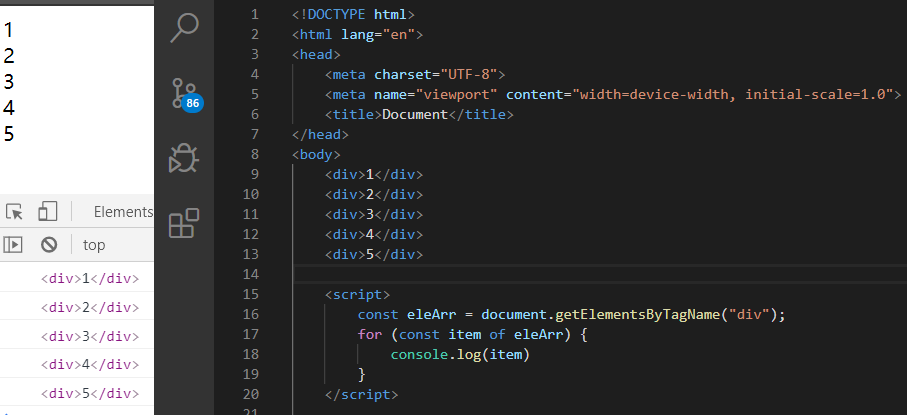


### 写一个可迭代的对象

没有办法直接对对象进行迭代，这会报出对象不能进行迭代的错误。

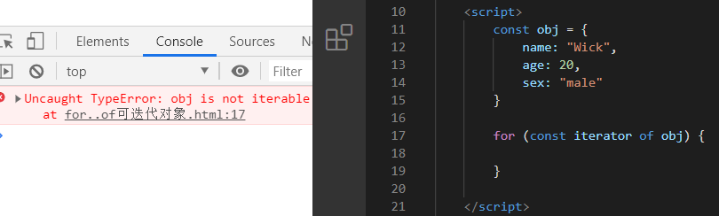

所以我们必须给它定义一个可迭代的规则！另外需要注意**必须返回对象，返回的对象中必须带有next方法**，否则会报错！

错误：Symbol.iterator方法返回的结果不是一个对象

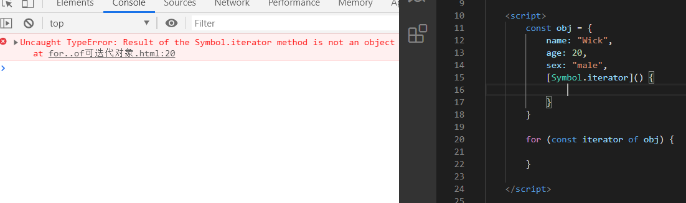

错误：未带有next()方法，所以没办法执行，从这里就可以看出`for...of`默认就是会去执行next方法，所以很容易就能知道，`for...of`的iterator(key)，其实就是next方法的返回值的value

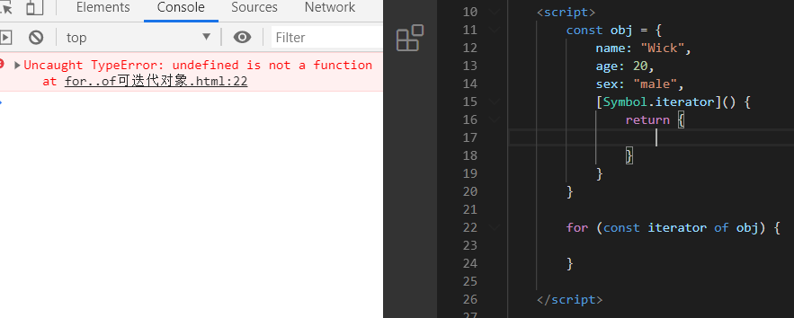


说了这么多，下面就开始说一下怎么写一个可迭代对象吧。

1. 获取对象的属性名

   要对对象进行迭代，肯定要知道属性名，这个属性名，可以通过Object.keys(obj)来获取

   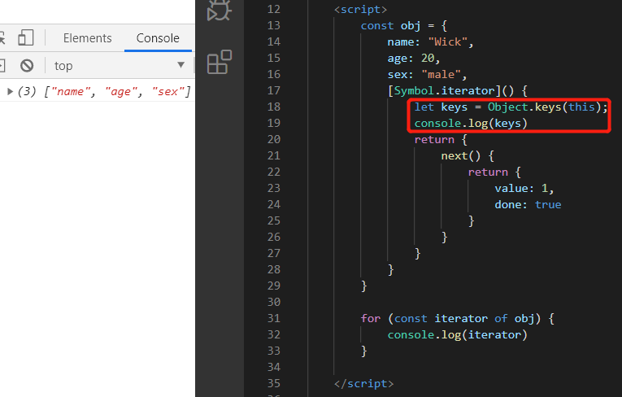

2. 拿到对应的属性值

   要拿到值，肯定也得弄一个指针，标记下位置(Object.keys的数组)，之后通过this访问对象，拿到属性值

   方法一：存储this

   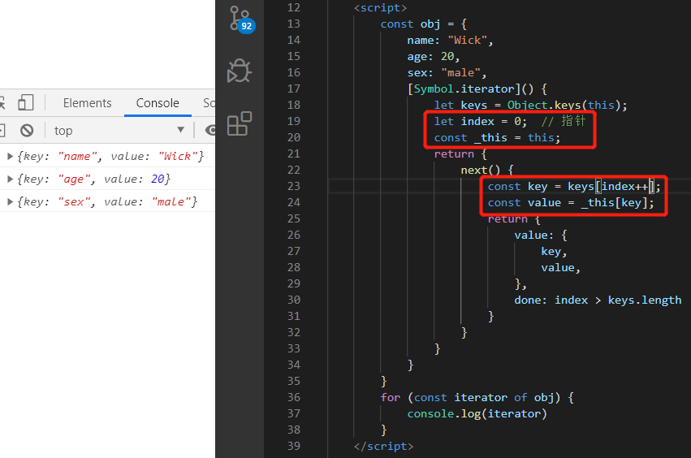

   方法二：箭头函数

   ​	利用箭头函数的特性，this由最近的非箭头函数决定，这里由Symbol.iterator`这个非箭头函数决定了

   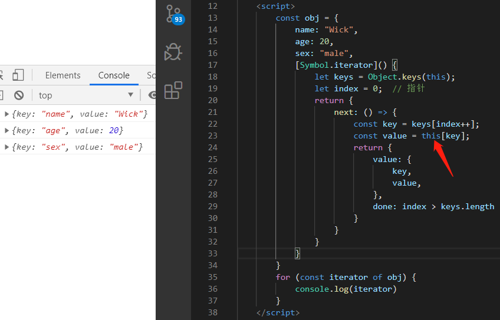


# 生成器(Generator)

## 什么是生成器？

生成器是一种返回迭代器对象的函数，也是ES6提供的一种异步编程的解决方案


为什么说是返回迭代器对象的函数？

还记得上文说的可迭代协议和迭代器协议么，生成器返回的对象，满足了协议，所以说它返回了一个迭代器对象。

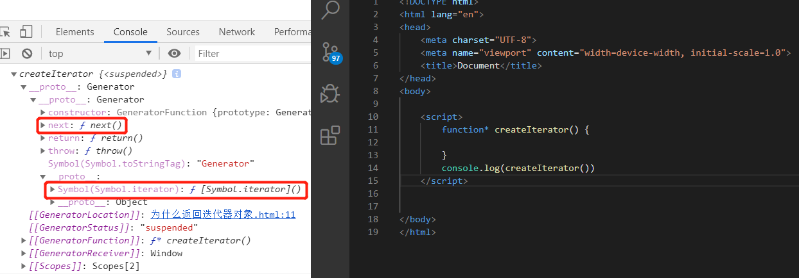


## 语法

生成器的语法行为和传统的函数的语法不同，它通过在function关键字后面添加一个`*`来进行表示。

```js
// 写法一 推荐！！！！！
function* createIterator() {
    
}
// 写法二
function *createIterator() {
    
}
// 写法三
function*createIterator() {
    
}
// 匿名函数(函数表达式)
const createIterator = function*() {
    
}
// 生成器对象方法
const obj = {
    *createIterator() {
 
    },
    // 下面这种也OK
    createIterator: function* () {
        
    }
}
```

注：别用箭头函数来创建生成器！！！！！！！！


## yield关键字

在说yield关键字前，先来康康生成器执行的效果。

没学过的生成器的小伙伴就震惊了，然后说出一句："我去，我这不是执行了嘛，咋没输出呢？？？"。不慌，我们带着这个问题往下看吧

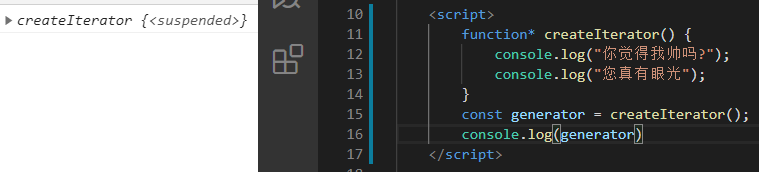


yield(产出)关键字是ES6中提出的一个新特性，它只能用在生成器函数中，并且是**用来指定迭代器对象调用next方法返回的值和返回顺序**。

啥意思？看看栗子。

就是说，你每次调用next方法，就会运行生成器函数的内部代码，让它指向某一个yield关键字位置。

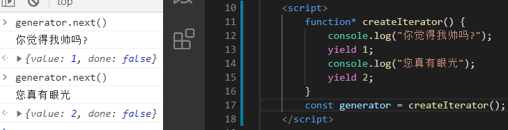

从上面的栗子中，可以发现，yield后面的值，就是迭代器对象返回的结果，**而且yield还可以中止函数的执行(你不next，它就停在那里，不会接着执行了)！**

只有调用了next方法，才会执行生成器函数的内部代码，不调用就不执行，所以有没有感觉生成器函数像一个提供迭代数据的容器？？


### 使用限制

yield关键字只能在生成器函数内部使用，这个内部使用，一定不能是嵌套函数

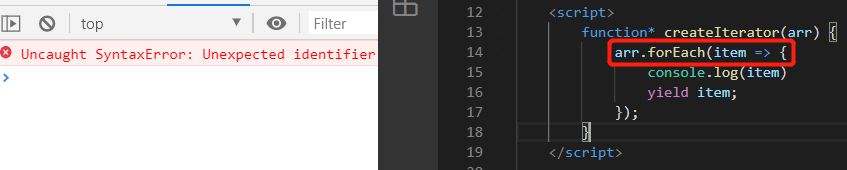


## Iterator的语法糖

Generator是Iterator的语法糖，我们在写iterator的时候，总是要自己写`return{}`、`next(){}`等操作，这样会非常麻烦。所以有了Generator，这些就没必要自己写了，它会帮我们搞定。

先看看迭代器的写法

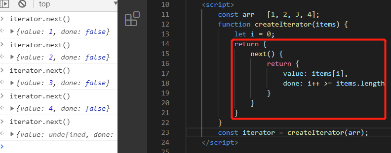

再来看看Generator的写法，怎么样，是不是很方便？

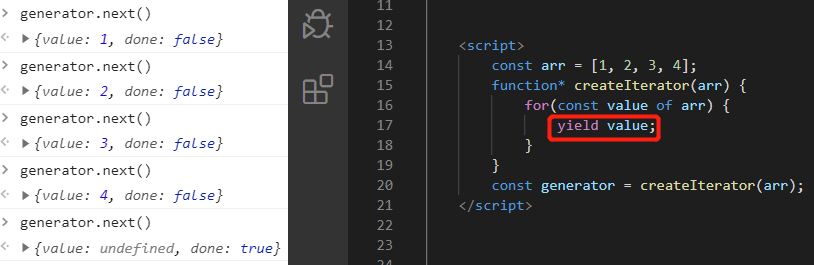

注：yield会是中止函数执行，所以当你第一次next的时候(也是for循环第一次)，整个函数都停止，包括for循环


## return返回值

生成器是可以有返回值的，这个返回值的结果只会出现在第一次done为true的时候，之后再调用next，结果都是undefined

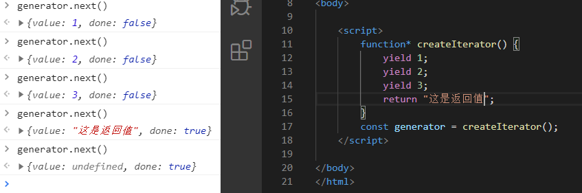

注意return的书写位置，如果写在yield前面，则后面的yield是没办法作为迭代数据的！！

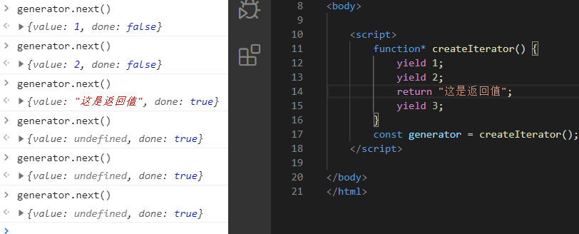


## next方法的参数

有时候迭代器在执行的时候，我们可能会希望它按我们的意愿进行执行，比如说需要一个参数，然后决定下一次next的结果。

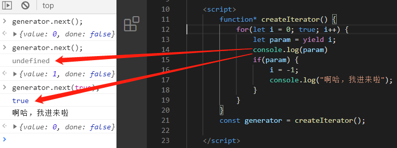

我们第一次调用next()的时候，返回了数据，但是并没有输出param，说明函数暂停在yield这，也还没有把参数值赋给param，直到下一次next，才进行赋值，并输出param。

特别注意，next方法的参数表示**上一个yield的返回值**，所以第一次传递的参数，会直接被V8引擎忽略，只有第二个开始才有效。语义上，第一个next方法用于启动迭代器对象，所以不用带参数

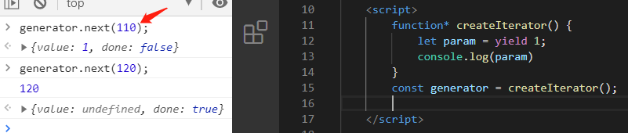

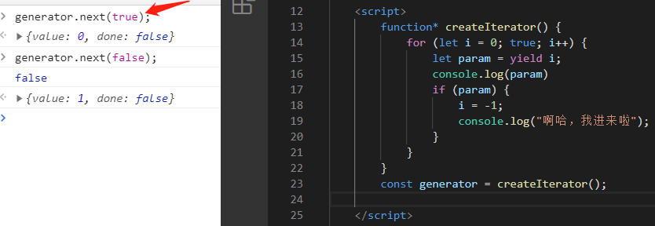


## 生成器的实例方法

### Generator.prototype.return()

跟我们在生成器内部使用的return有一样的作用，中止迭代器和给定返回值

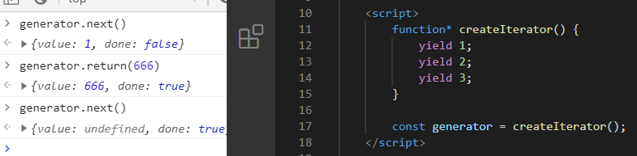

如果生成器内部有`try..finally`结果，并且碰巧执行到`try`代码块，那么使用return的话，会直接进行`finally`代码块，直到`finally`代码块执行完毕，整个迭代过程才会结束

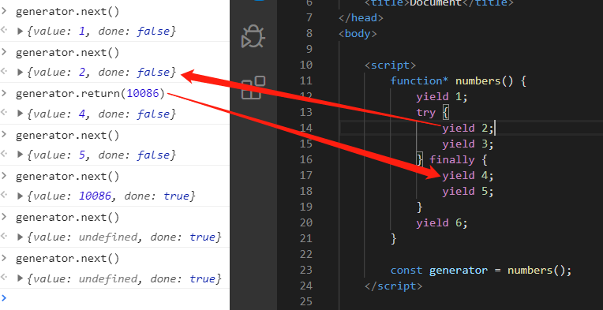


展开运算符和`for...of`会直接忽略通过return语句指定的任何返回值，只要done为true，就立刻停止读取其他的值。

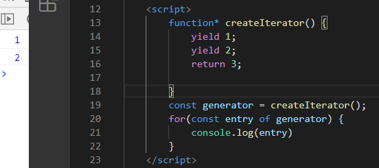

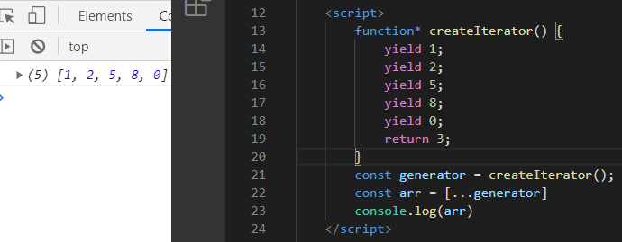


### Generator.prototype.throw()

调用迭代器对象的throw方法，可以在函数体外抛出一个错误，然后在Generator函数体内捕获。

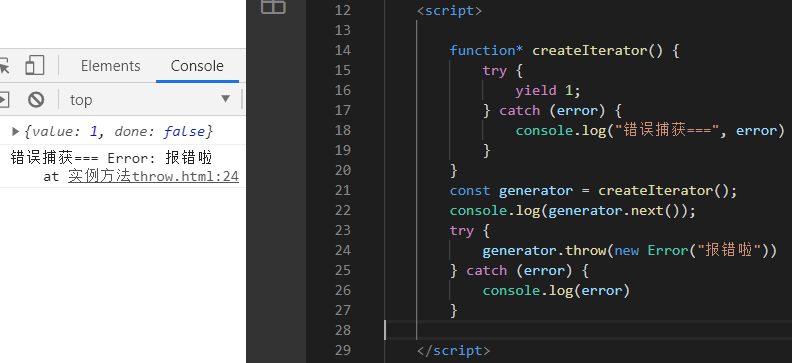

几个特殊的点，需要记一下

1. throw方法如果被捕获，会附带执行一次next方法

   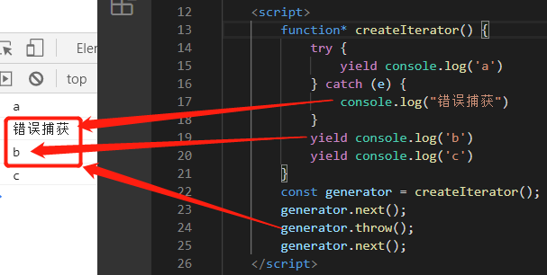
   当然也可以返回结果对象

   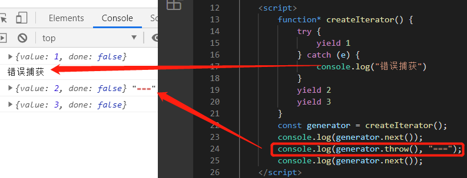

   

2. throw抛出的错误要被内部捕获，前提是必须执行过一次next方法

   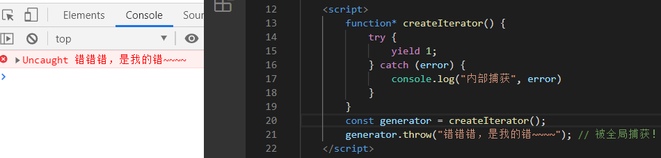


# 内建迭代器

在ES6中，已经默认为内建类型提供了内建迭代器，只有当这些内建迭代器满足不了你的时候，你才需要自己定义去迭代器。一般来说，只有你自己写的类和对象，才会遇到这种情况，否则都可以用内建迭代器实现。


## 集合迭代器

在ES6中，有三种类型的集合对象：Array、Map、Set，这三种集合都有以下三种内建迭代器

### entries()

调用该方法，返回一个迭代器，值为数组形式的键值对，`[key,value]`。

迭代对象为数组：`[index, value]`

迭代对象为Set：`[value, value]`

迭代对象为Map：`[key, value]`

```js
const colors = ['red', 'pink', 'blue'];
const numSet = new Set([123, 456, 789]);
const myInfoMap = new Map();
myInfoMap.set("name", "Wick");
myInfoMap.set("sex", "male");
// 分割线
console.log("Array")
for(const entry of colors.entries()) {
    console.log(entry)
}
console.log("Set")
for(const entry of numSet.entries()) {
    console.log(entry)
}
console.log("Map")
for(const entry of myInfoMap.entries()) {
    console.log(entry)
}
```

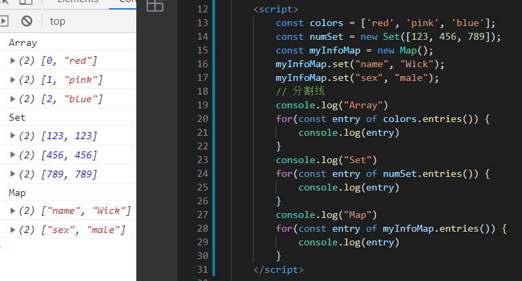


### values()

调用该方法，返回一个迭代器，值为集合中的值。

```js
const colors = ['red', 'pink', 'blue'];
const numSet = new Set([123, 456, 789]);
const myInfoMap = new Map();
myInfoMap.set("name", "Wick");
myInfoMap.set("sex", "male");
// 分割线
console.log("===Array===")
for(const value of colors.values()) {
    console.log(value)
}   
console.log("===Set===")
for(const value of numSet.values()) {
    console.log(value)
}
console.log("===Map===")
for(const value of myInfoMap.values()) {
    console.log(value)
}
```

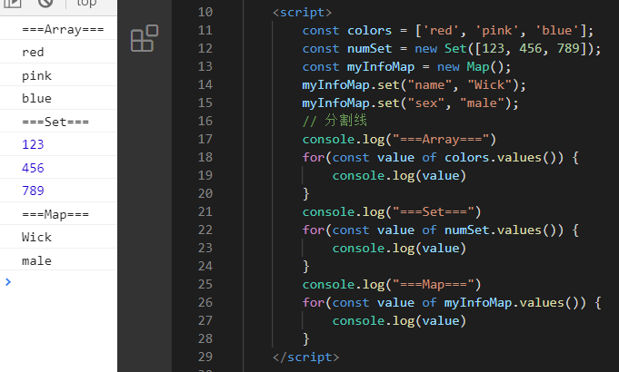


### keys()

调用该方法，返回一个迭代器，值为集合中所有的键。

```js
const colors = ['red', 'pink', 'blue'];
const numSet = new Set([123, 456, 789]);
const myInfoMap = new Map();
myInfoMap.set("name", "Wick");
myInfoMap.set("sex", "male");
// 分割线
console.log("===Array===")
for(const entry of colors.keys()) {
    console.log(entry)
}
console.log("===Set===")
for(const entry of numSet.keys()) {
    console.log(entry)
}
console.log("===Map===")
for(const entry of myInfoMap.keys()) {
    console.log(entry)
}
```

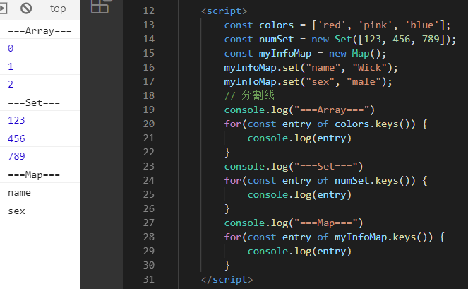

注意，对于Set集合，由于kv是相同的，所以keys()和values返回的也是相同的迭代器。


每个集合类型都有默认的迭代器，在`for...of`循环中，如果没有显示(自己定义)指定则使用默认迭代器，数组和Set采用values迭代器，Map采用entries迭代器。

```js
const colors = ['red', 'pink', 'blue'];
        const numSet = new Set([123, 456, 789]);
        const myInfoMap = new Map();
        myInfoMap.set("name", "Wick");
        myInfoMap.set("sex", "male");
        // Array ===> values
        for(const entry of colors) {
            console.log(entry)
        }
        // Set ===> values
        for(const entry of numSet) {
            console.log(entry)
        }
        // Map ===> entries
        for(const entry of myInfoMap) {
            console.log(entry)
        }
```

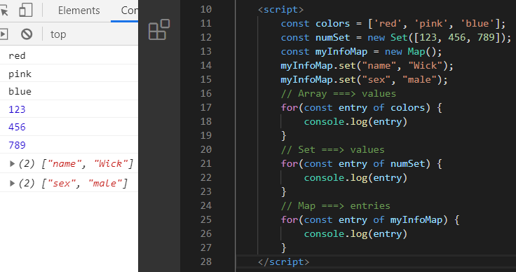


# 展开运算符与可迭代对象

展开运算符`...`，可以用来操作任何可迭代对象，并根据默认迭代器来选取要引用的值。

Set，默认迭代器，values

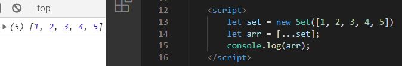

Map，默认迭代器，entries

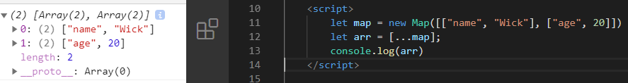

对象，自定义迭代器

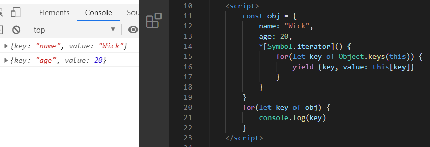


# 委托生成器yield*

在某些情况下，我们可能需要将两个迭代器**合二为一**，这时可以创建一个生成器，再给yield语句添加一个`*`号，就可以将生成数据的过程委托给其他迭代器。

## 语法

```js
// 写法一
yield* 生成器函数名();
// 写法二,推荐！！！
yield *生成器函数名();
```

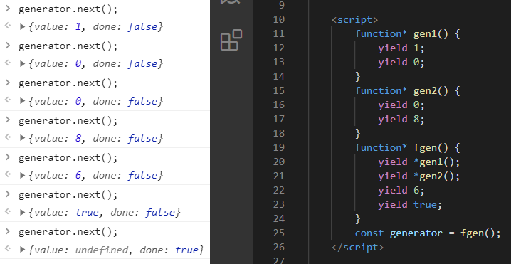


## 应用

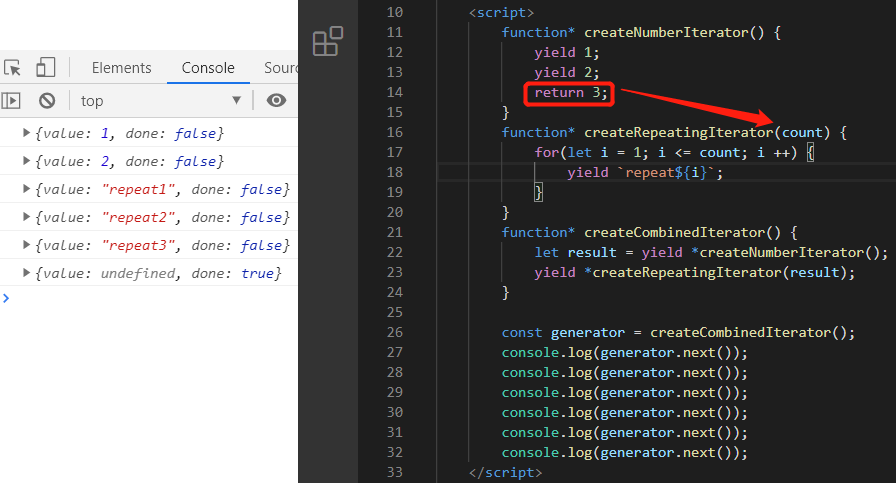

在生成器createCombinedIterator()中，执行过程线被委托给了createNumberIterator()，当createNumberIterator()迭代完成后，就会把这个返回值赋给createCombinedIterator的result，之后我们在对createCombinedIterator进行next，那么就会把执行过程委托给createRepeatingIterator()，并把result传入，这时候在createRepeatingIterator中有了result个yield供我们使用。当委托全部执行完后，后续已经没有任何yield够我们执行，所以迭代结束。


只要`yield *`后面的表达式是可迭代的对象，那么就能进行委托，比如String、Array

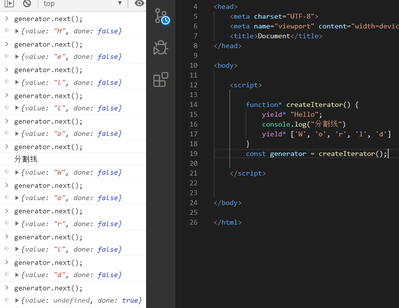


千万记得加`*`号，否则生成器执行完，你拿到的就只是一个迭代器

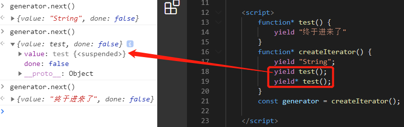


### 数组扁平化

"降维打击"

```js
const arr = [
    1,
    [2, 3, 4, [5, 6, [7, 8]]],
    [9,10,
     [11,
      [12,[13]]
     ]
    ]
];

function* createArrayIterator(arr) {
    for (const item of arr) {
        if (Array.isArray(item)) {
            yield* createArrayIterator(item);   // 递归
        } else {
            yield item;
        }
    }
}
function flat(arr) {
    const tempArr = [];
    for (const value of createArrayIterator(arr)) {
        tempArr.push(value)
    }
    return tempArr;
}
console.log(flat(arr))
```

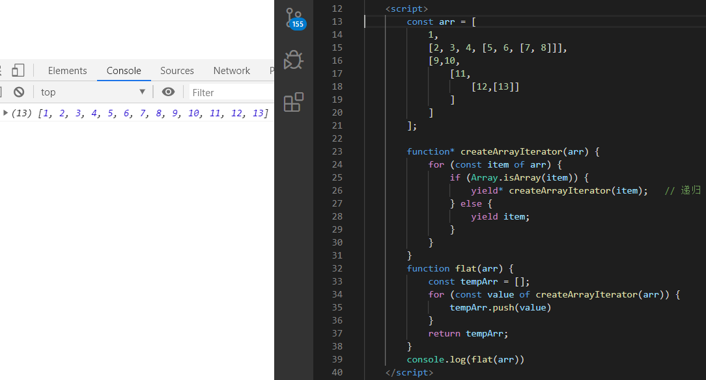


# 参考文章

[MDN—迭代协议](https://developer.mozilla.org/zh-CN/docs/Web/JavaScript/Reference/Iteration_protocols)

[阮一峰—Iterator](https://es6.ruanyifeng.com/#docs/iterator)

[阮一峰—Generator](https://es6.ruanyifeng.com/#docs/generator#Generator-prototype-return)

