# 效果展示

样式可能有点丑，请不要在意

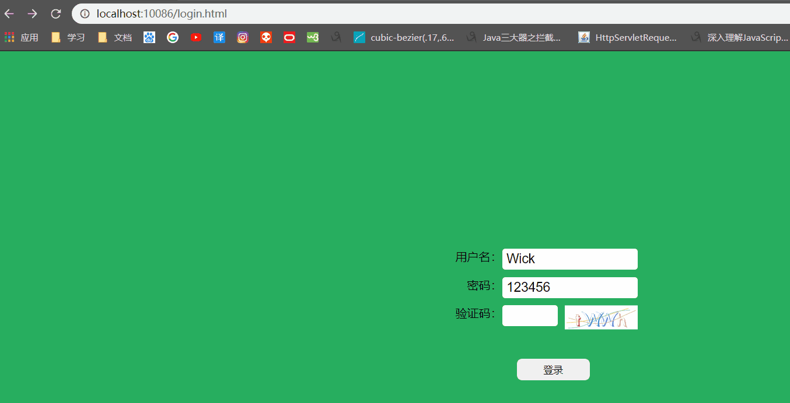


# 用到的技术

express、vue、redis、axios

# 功能实现

## 图片验证码生成

`svg-captcha`是一个可以生成图形验证码的模块，详细介绍移步[svg-captcha文档](https://www.npmjs.com/package/svg-captcha)

下载`svg-captcha`模块

```npm
npm i svg-captcha -S
```

在nodejs中引入

```js
const code = require("svg-captcha");
```

之后对模块进行配置并导出

```js
const code = require("svg-captcha");
function createCode() {
    return code.create({
        size: 4,
        ignoreChars: "0o1iIl",
        noise: 3,
        color: true,
        background: "#fff",
        fontSize: 60
    });
}
module.exports = createCode;
```

模块导出后在后端路由模块中引入生成图片验证码的模块

```js
const captcha = require("./Code")
```

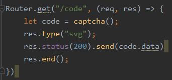

`svg-captcha`的实例，给我们提供了两个属性

- data：验证码svg
- text：验证码文本

我们要让前端显示的肯定是svg格式的图片，不可能是text文本，因为如果要爬虫模拟登录，岂不是太简单了？

之后访问验证码接口地址，就可以看到图片了。

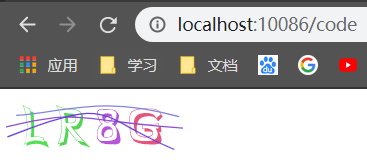


## 前端页面代码

所有框架和工具，我引的都是CND

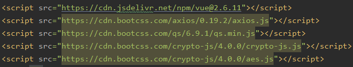

html部分

```html
<div id="app">
    <p><label>用户名：</label><input type="text" ref="username" value="Wick"></p>
    <p><label>密码：</label><input type="text" ref="password" value="123456"></p>
    <p id="code">
        <label>验证码：</label>
        <input ref="codeValue" type="text">
        
    </p>
    <button id="login" @click="login">登录</button>
</div>
```

js部分

```js
axios.defaults.baseURL = "http://localhost:10086";
axios.defaults.headers.post['Content-Type'] = 'application/x-www-form-urlencoded';
axios.defaults.withCredentials = true;
axios.interceptors.request.use(config => {
    return config;
})
const app = new Vue({
    el: "#app",
    data: {
        codeImg: `http://localhost:10086/code?t=${new Date().getTime()}`
    },
    methods: {
        getCode() {
            // 添加时间戳进行验证码切换
            this.codeImg = `http://localhost:10086/code?t=${new Date().getTime()}`;
            this.$refs.codeValue.value = "";
        },
        login() {
            let username = this.$refs.username.value;
            let password = this.$refs.password.value;
            let code = this.$refs.codeValue.value;
            let data = {
                username,
                password: CryptoJS.AES.encrypt(password, username).toString(),   //密码加密
                code
            }
            axios.post("/login", Qs.stringify(data)).then(res => {
                alert(res.data.msg);
                if(res.data.success === "ok") {
                    window.location = "/Home.html";
                }
            })
        }
    }
});
```


## 引入express-session

原生nodejs未提供session功能，所以我们只能引入第三方模块`express-session`

下载`express-session`

```npm
npm i -S express-session
```

nodejs引入`express-session`

```js
const session = require("express-session");
```

中间件设置，详细配置移步[express-session文档](https://www.npmjs.com/package/express-session)

```js
app.use(session({
    secret: "WickYo",	// 对cookie进行签名
    name: "session",	// cookie名称，默认为connect.sid
    resave: false,	// 强制将会话保存回会话容器
    rolling: true,	// 强制在每个response上设置会话标识符cookie
    cookie: {
        // 5分钟
     	maxAge: 300000
    }
}))
```

配置之后，页面的response都会带有这个session

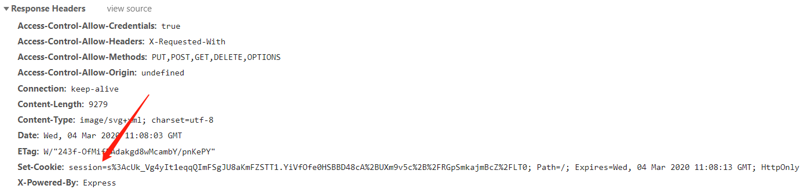

查看一下Application里的cookies

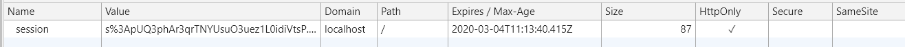

这里的session的存活时间，我是用来做验证码是否失效的，当session过期了，那么验证码也就跟着失效，那么就需要切换验证进行登录

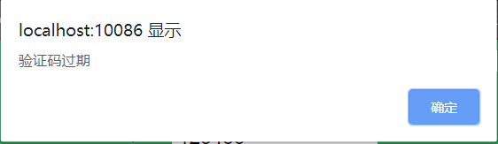


## 引入redis并设置验证码

下载`redis`模块

```npm
npm i redis -S
```

nodejs中引入

```js
const redis = require("redis");
```

对redis进行配置，这里只是简单配置，详细移步[redis文档](https://www.npmjs.com/package/redis)

```js
const client = redis.createClient({
    host: "192.168.56.101",	//	redis地址
    port: 6379	// 端口号
})
// 监听连接事件
client.on("connect", error => {
    if(!error) {
        console.log("connect to redis")
    }
})
// 监听错误事件
client.on("error", error => {
    throw new Error(error)
})
```

封装set方法

```js
function setString(key, value, expire) {
    return new Promise((resolve, reject) => {
        client.set(key, value, (error, replay) => {
            if(error) {
                reject("设置失败")
            }
            if(expire) {
                client.expire(key, expire);
            }
            resolve("设置成功")
        });
    })
}
```

封装get方法

```js
function getString(key) {
    return new Promise((resolve, reject) => {
        if(key) {
            client.get(key, (error, replay) => {
                if(error) {
                    reject(`获取${key}失败`)
                }
                resolve(replay);
            })
        }
    })
}
```

最后导出方法。

```js
module.exports = {
    setString,
    getString
}
```

上面封装了set和get方法，那么我们就可以在redis中设置值了。

经过前面的`express-session`配置之后，我们在进入页面时，就会加载验证码图片并设置cookie(存着sessionID的值)，然后在登录的时候，会带上这个cookie。那这样，我们就可以在获取图片的时候，以sessionID值为key，`svg-captcha`的text为value进行设置

注：sessionID是使用了`express-session`后注入的

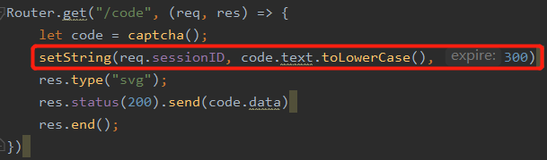

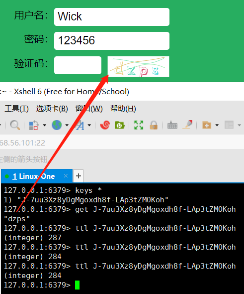


## 登录功能实现

为了方便，就不连接数据库了，直接创建一个本地的文件当做用户的账号密码吧

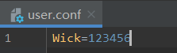

直接上代码

```js
Router.post("/login", (req, res) => {
    let username = req.body.username;
    let password = CryptoJS.AES.decrypt(req.body.password, username).toString(CryptoJS.enc.Utf8);   // 解密
    let code = req.body.code.toLowerCase();
    if(!req.signedCookies.session) {
        res.send({success: "no", msg: "验证码过期"})
        return;
    }
    // redis封装的方法
    getString(req.signedCookies.session).then(data => {
        // signedCookies即被签名过的cookie
        console.log(data)
        if(code === data) {
            console.log("验证码正确")
            // 读文件
            fs.readFile(__dirname + "/../user.conf", "utf8", (err, data) => {
                let dataArr = data.toString().split("=");
                if(username === dataArr[0]) {
                    if(password === dataArr[1]) {
                        // 根据登录用户名设置cookie，并规定只能cookie存活30分钟
                        res.cookie("uid", username, {maxAge: 300000})
                        res.send({success: "ok", msg: "登录成功"})
                        return;
                    }
                }
                res.send({success: "no", msg: "用户名或密码错误"})
            })
        } else {
            res.send({success: "no", msg: "验证码错误"})
        }
    }).catch(err => {
        console.log(err)
    })
})
```


### 引入cookie-parser

我们可以引入`cookie-parse`对cookie进行解密

中间件设置

```js
app.use(cookieParser(secret))
```

配置好之后，就能解析出被指定secret加密过的cookie了


### 获取post请求参数

我们没办法直接获取到post的参数，需要安装`body-parser`模块，才能进行获取

```npm
npm i -S body-parser
```

配置`body-parser`

```js
app.use(bodyParser.urlencoded({ extended: false }))	//解析application/x-www-form-urlencoded
```

配置之后，我们就能获取到请求体了

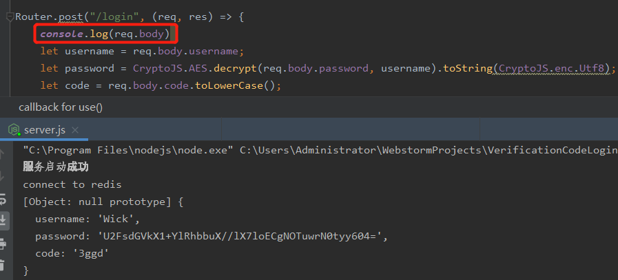


### 什么是Signed cookie？

cookie有一个不好地方的，就是在浏览器中可见，并且是可以修改的，如果我们直接把敏感信息存储在cookie中，那么任何人都可见，任何人都可对其进行修改，这是很不安全的。

正是因为不安全，所以才会需要签名Cookie(Signed Cookie)对其进行加密，以防止被某些信息被泄露。


我们手动对加密后的cookie进行解密

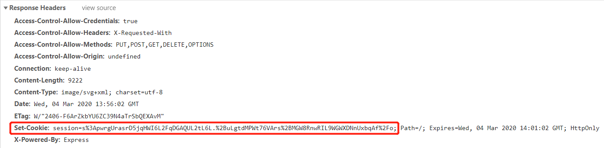

解密出来的值，其实就是在获取验证码时的sessionID。

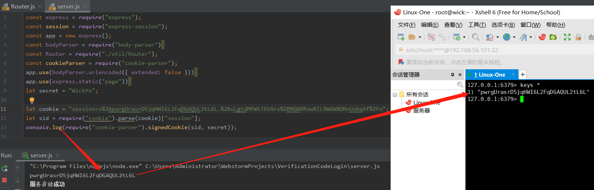

所以，我们能通过`req.signedCookies`获取对应的cookie，都是因为`cookie-parser`帮我们做了解密。


本文已收录至github：https://github.com/OnlyWick/FullStack

<span style="color: red">如有错误，请及时指出！</span>